# SSH客户端配置文件详细解释

## 目录
- [三层SSH架构详解](#三层ssh架构详解)
- [SSH密钥和配置文件分析](#ssh密钥和配置文件分析)
- [SSH Agent Forwarding机制](#ssh-agent-forwarding机制)
- [CI/CD环境中的SSH配置](#cicd环境中的ssh配置)
- [配置项详解](#配置项详解)
- [故障排除和最佳实践](#故障排除和最佳实践)

## 三层SSH架构详解

### 架构概述

在现代DevOps环境中，SSH连接通常采用三层架构模式，确保安全性和可管理性：

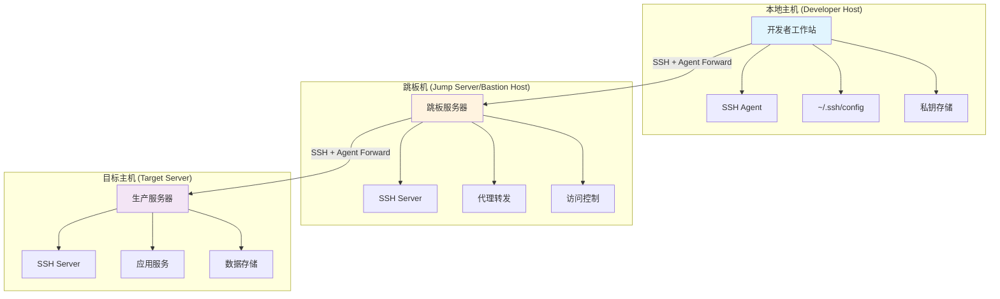

### 1. 本地主机（Developer Host）配置

**角色**: 开发者工作站，SSH连接的起点
**核心功能**: SSH密钥管理、代理启动、连接配置

#### 必需组件：
- **SSH Agent**: 管理私钥，提供认证服务
- **SSH客户端配置**: `~/.ssh/config`文件配置连接参数
- **私钥存储**: 安全存储SSH私钥文件

#### 配置示例：
```bash
# ~/.ssh/config - 本地主机配置
Host jumpserver
    HostName jump.example.com
    User admin
    Port 22
    ForwardAgent yes                    # 启用代理转发
    AddKeysToAgent yes                  # 自动添加密钥到代理
    IdentityFile ~/.ssh/id_rsa_jump     # 跳板机专用密钥
    ServerAliveInterval 60
    ServerAliveCountMax 3

Host production-*
    ProxyJump jumpserver                # 通过跳板机连接
    ForwardAgent yes                    # 继续转发代理
    User deploy
    IdentityFile ~/.ssh/id_rsa_prod     # 生产环境密钥
    StrictHostKeyChecking yes           # 严格主机验证
```

### 2. 跳板机（Jump Server/Bastion Host）配置

**角色**: 安全网关，控制对内网资源的访问
**核心功能**: 代理转发、访问控制、审计日志

#### 服务器端配置：
```bash
# /etc/ssh/sshd_config - 跳板机SSH服务配置
Port 22
Protocol 2
PermitRootLogin no
PasswordAuthentication no               # 禁用密码认证
PubkeyAuthentication yes               # 启用公钥认证
AuthorizedKeysFile .ssh/authorized_keys
AllowAgentForwarding yes               # 允许代理转发
AllowTcpForwarding yes                 # 允许TCP转发
X11Forwarding no                       # 禁用X11转发
MaxAuthTries 3
ClientAliveInterval 300
ClientAliveCountMax 2
```

#### 客户端配置（跳板机上的SSH客户端）：
```bash
# ~/.ssh/config - 跳板机上的客户端配置
Host production-*
    User deploy
    ForwardAgent yes                    # 转发来自本地的代理
    StrictHostKeyChecking yes
    UserKnownHostsFile ~/.ssh/known_hosts_production
```

### 3. 目标主机（Target Server）配置

**角色**: 最终目标服务器，运行实际应用
**核心功能**: 接受代理转发的认证，提供服务访问

#### 服务器端配置：
```bash
# /etc/ssh/sshd_config - 目标服务器SSH配置
Port 22
Protocol 2
PermitRootLogin no
PasswordAuthentication no               # 禁用密码认证
PubkeyAuthentication yes               # 启用公钥认证
AuthorizedKeysFile .ssh/authorized_keys
AllowAgentForwarding no                # 目标服务器通常不需要继续转发
AllowTcpForwarding no                  # 限制端口转发
X11Forwarding no
MaxAuthTries 3
ClientAliveInterval 300
ClientAliveCountMax 2
AllowUsers deploy                      # 限制允许的用户
```

### 三层架构的安全优势

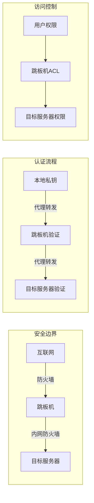

**安全特性**:
1. **网络隔离**: 目标服务器不直接暴露在互联网
2. **集中认证**: 跳板机作为认证和授权的中心点
3. **审计追踪**: 所有连接都通过跳板机，便于审计
4. **密钥安全**: 私钥只存储在本地，通过代理转发使用

## SSH密钥和配置文件分析

### 密钥分发和信任关系

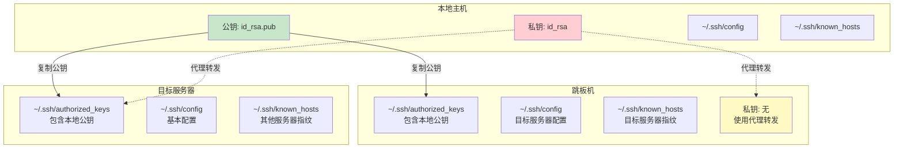

### 各节点配置文件详解

#### 1. ~/.ssh/config 文件分析

**本地主机的 ~/.ssh/config**:
```bash
# 全局默认配置
Host *
    ForwardAgent yes                    # 启用代理转发
    AddKeysToAgent yes                  # 自动添加密钥
    ServerAliveInterval 60              # 保活设置
    ServerAliveCountMax 3
    Compression yes                     # 启用压缩
    TCPKeepAlive yes

# 跳板机配置
Host jumpserver jump
    HostName jump.example.com
    User admin
    Port 22
    IdentityFile ~/.ssh/id_rsa_jump     # 跳板机专用密钥
    ForwardAgent yes
    StrictHostKeyChecking yes           # 严格验证跳板机

# 生产环境服务器（通过跳板机）
Host prod-web-*
    ProxyJump jumpserver                # 通过跳板机连接
    User deploy
    IdentityFile ~/.ssh/id_rsa_prod     # 生产环境密钥
    ForwardAgent yes
    StrictHostKeyChecking yes

# 开发环境服务器（直连）
Host dev-*
    User developer
    IdentityFile ~/.ssh/id_rsa_dev      # 开发环境密钥
    ForwardAgent yes
    StrictHostKeyChecking ask           # 开发环境可以询问
```

**跳板机的 ~/.ssh/config**:
```bash
# 目标服务器配置
Host prod-web-*
    User deploy
    ForwardAgent yes                    # 转发代理到目标服务器
    StrictHostKeyChecking yes
    UserKnownHostsFile ~/.ssh/known_hosts_production

Host prod-db-*
    User dbadmin
    ForwardAgent no                     # 数据库服务器不转发代理
    StrictHostKeyChecking yes
    Port 2222                          # 数据库服务器使用非标准端口
```

#### 2. ~/.ssh/authorized_keys 文件分析

**跳板机的 ~/.ssh/authorized_keys**:
```bash
# 开发者A的公钥 - 来自本地主机
ssh-rsa AAAAB3NzaC1yc2EAAAADAQABAAABgQC7... developer-a@local-host

# 开发者B的公钥 - 来自本地主机
ssh-rsa AAAAB3NzaC1yc2EAAAADAQABAAABgQD8... developer-b@local-host

# CI/CD系统的公钥 - 来自构建服务器
ssh-rsa AAAAB3NzaC1yc2EAAAADAQABAAABgQE1... ci-system@build-server

# 带限制的公钥示例
command="echo 'Welcome to jumpserver'",no-port-forwarding,no-X11-forwarding ssh-rsa AAAAB3... restricted-user@host
```

**目标服务器的 ~/.ssh/authorized_keys**:
```bash
# 同样的开发者公钥 - 通过代理转发认证
ssh-rsa AAAAB3NzaC1yc2EAAAADAQABAAABgQC7... developer-a@local-host
ssh-rsa AAAAB3NzaC1yc2EAAAADAQABAAABgQD8... developer-b@local-host

# 部署专用公钥 - 用于自动化部署
ssh-rsa AAAAB3NzaC1yc2EAAAADAQABAAABgQF2... deploy-key@ci-system

# 带环境限制的公钥
from="192.168.1.0/24",command="/usr/local/bin/deploy.sh" ssh-rsa AAAAB3... deploy-restricted@jumpserver
```

#### 3. ~/.ssh/known_hosts 文件分析

**本地主机的 ~/.ssh/known_hosts**:
```bash
# 跳板机的主机密钥指纹
jump.example.com,203.0.113.10 ssh-rsa AAAAB3NzaC1yc2EAAAADAQABAAABgQC9...

# 直连的开发服务器指纹
dev-server.example.com,192.168.1.100 ssh-ed25519 AAAAC3NzaC1lZDI1NTE5...

# 使用哈希格式的主机指纹（更安全）
|1|JfKTdBh7rNbXkVAQCRp4OQoPfmI=|USECr3SWAqHkuPa0xFOUPBUaUiM= ssh-rsa AAAAB3...
```

**跳板机的 ~/.ssh/known_hosts**:
```bash
# 生产环境服务器指纹
prod-web-01,10.0.1.10 ssh-rsa AAAAB3NzaC1yc2EAAAADAQABAAABgQD1...
prod-web-02,10.0.1.11 ssh-rsa AAAAB3NzaC1yc2EAAAADAQABAAABgQD2...
prod-db-01,10.0.2.10 ssh-ed25519 AAAAC3NzaC1lZDI1NTE5AAAAID...

# 使用通配符的主机指纹
*.prod.internal ssh-rsa AAAAB3NzaC1yc2EAAAADAQABAAABgQD3...
```

### 密钥管理最佳实践

#### 密钥生成和分发流程

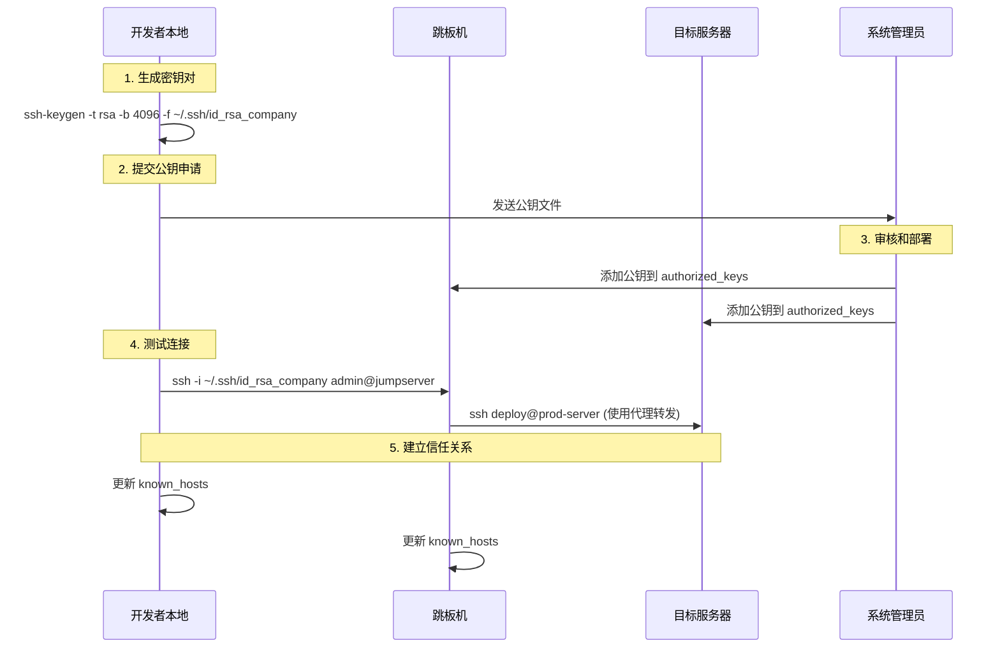

#### 密钥轮换策略

```bash
#!/bin/bash
# 密钥轮换脚本示例

# 1. 生成新密钥
ssh-keygen -t rsa -b 4096 -f ~/.ssh/id_rsa_new -N ""

# 2. 备份旧密钥
cp ~/.ssh/id_rsa ~/.ssh/id_rsa.backup.$(date +%Y%m%d)

# 3. 部署新公钥到所有服务器
for server in jumpserver prod-web-01 prod-web-02; do
    ssh-copy-id -i ~/.ssh/id_rsa_new.pub $server
done

# 4. 测试新密钥
ssh -i ~/.ssh/id_rsa_new jumpserver "echo 'New key works'"

# 5. 更新默认密钥
mv ~/.ssh/id_rsa_new ~/.ssh/id_rsa
mv ~/.ssh/id_rsa_new.pub ~/.ssh/id_rsa.pub

# 6. 从服务器移除旧公钥（在确认新密钥工作后）
# 这一步需要谨慎操作，建议手动执行
```

## 配置项详解

### 1. ForwardAgent yes
**作用**: 启用SSH代理转发功能
**工作原理**:
- 将本地SSH代理的认证请求转发到远程服务器
- 远程服务器可以使用本地的SSH密钥进行进一步的SSH连接
- 实现"跳板机"功能，无需在中间服务器存储私钥

**使用场景**:
```
本地机器 → 跳板机 → 目标服务器
    ↓         ↓         ↓
  SSH代理 → 代理转发 → 使用本地密钥
```

### 2. AddKeysToAgent yes
**作用**: 自动将使用的SSH密钥添加到SSH代理
**工作原理**:
- 首次使用密钥时自动添加到代理
- 避免重复输入密钥密码
- 与SSH代理管理系统协同工作

**生命周期**:
```
SSH连接 → 检查代理 → 密钥不存在 → 自动添加 → 缓存密钥
```

### 3. UseKeychain yes
**作用**: 在macOS上使用系统钥匙串存储密钥密码
**注意**: 在Linux系统上此选项通常被忽略

### 4. IdentitiesOnly no
**作用**: 不限制只使用配置文件中指定的身份验证
**工作原理**:
- 允许SSH客户端尝试代理中的所有密钥
- 提高连接成功率
- 与代理转发配合使用

### 5. ServerAliveInterval 60
**作用**: 每60秒发送一次保活消息
**目的**:
- 防止连接因空闲而被防火墙断开
- 保持SSH代理转发连接活跃
- 提高长时间连接的稳定性

### 6. ServerAliveCountMax 3
**作用**: 最多发送3次保活消息无响应后断开连接
**配合**: 与ServerAliveInterval配合使用
**超时计算**: 60秒 × 3次 = 180秒无响应后断开

## SSH Agent Forwarding机制

### Agent Forwarding 工作原理

SSH Agent Forwarding 是一种安全机制，允许在远程服务器上使用本地SSH代理进行认证，而无需将私钥复制到远程服务器。

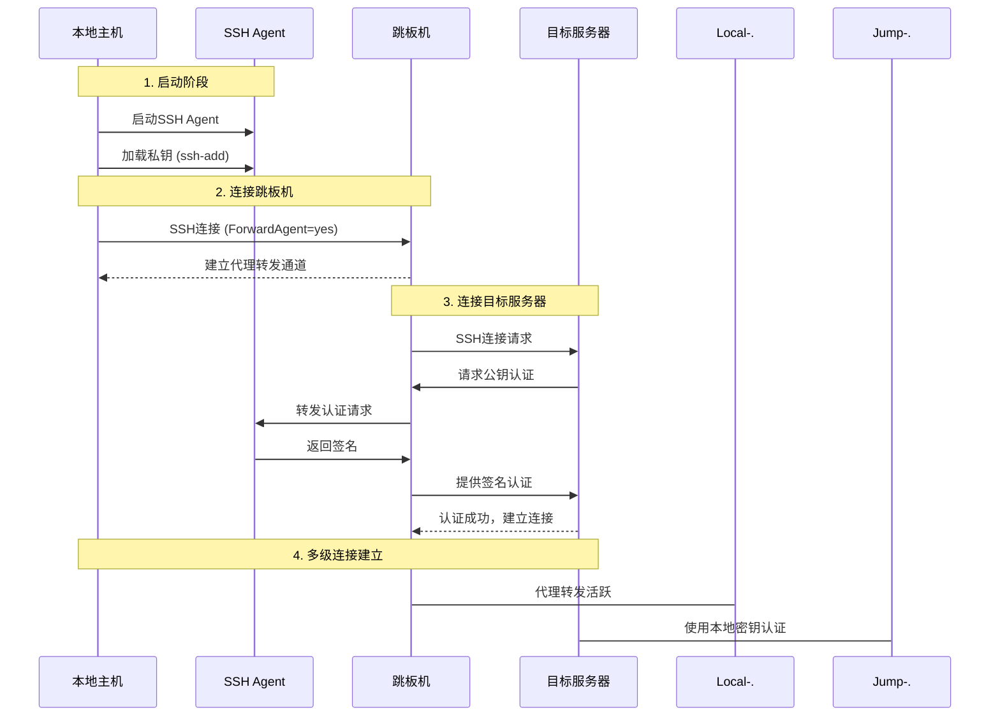

### 详细的Agent Forwarding流程

#### 阶段1：本地Agent准备
```bash
# 1. 启动SSH Agent
eval $(ssh-agent -s)

# 2. 添加私钥到Agent
ssh-add ~/.ssh/id_rsa_jump      # 跳板机密钥
ssh-add ~/.ssh/id_rsa_prod      # 生产环境密钥

# 3. 验证Agent状态
ssh-add -l
# 输出示例：
# 4096 SHA256:abc123... ~/.ssh/id_rsa_jump (RSA)
# 4096 SHA256:def456... ~/.ssh/id_rsa_prod (RSA)

# 4. 检查Agent环境变量
echo $SSH_AUTH_SOCK
# 输出示例：/tmp/ssh-agent.12345/agent.12345
```

#### 阶段2：建立代理转发连接
```bash
# 连接跳板机并启用代理转发
ssh -A admin@jumpserver
# 或使用配置文件中的 ForwardAgent yes

# 在跳板机上验证代理转发
echo $SSH_AUTH_SOCK
# 输出示例：/tmp/ssh-agent.67890/agent.67890

ssh-add -l
# 显示与本地相同的密钥列表
```

#### 阶段3：多级连接认证流程

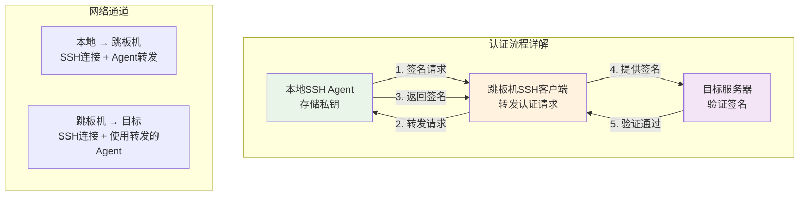

### 必要的配置项详解

#### 客户端配置（本地主机和跳板机）

```bash
# ~/.ssh/config
Host jumpserver
    HostName jump.example.com
    User admin
    ForwardAgent yes                    # 核心配置：启用代理转发
    AddKeysToAgent yes                  # 自动添加使用的密钥
    IdentitiesOnly no                   # 允许尝试Agent中的所有密钥

Host production-*
    ProxyJump jumpserver                # 通过跳板机连接
    User deploy
    ForwardAgent yes                    # 继续转发Agent到目标服务器
    IdentitiesOnly yes                  # 生产环境使用指定密钥
    IdentityFile ~/.ssh/id_rsa_prod
```

#### 服务器端配置

**跳板机 /etc/ssh/sshd_config**:
```bash
# Agent转发相关配置
AllowAgentForwarding yes               # 允许Agent转发
AllowTcpForwarding yes                 # 允许TCP转发（Agent转发需要）

# 安全配置
PasswordAuthentication no              # 禁用密码认证
PubkeyAuthentication yes              # 启用公钥认证
AuthorizedKeysFile .ssh/authorized_keys
PermitRootLogin no                    # 禁止root登录
MaxAuthTries 3                        # 限制认证尝试次数
```

**目标服务器 /etc/ssh/sshd_config**:
```bash
# 根据需要配置Agent转发
AllowAgentForwarding no                # 目标服务器通常不需要继续转发
AllowTcpForwarding no                  # 限制端口转发

# 严格的安全配置
PasswordAuthentication no
PubkeyAuthentication yes
AuthorizedKeysFile .ssh/authorized_keys
PermitRootLogin no
AllowUsers deploy                      # 限制允许的用户
```

### Agent Forwarding 安全考虑

#### 安全风险和缓解措施

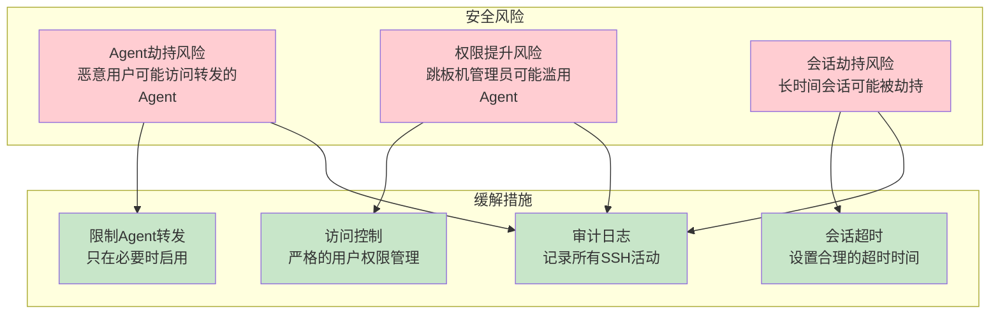

#### 最佳安全实践

1. **选择性启用Agent转发**:
```bash
# 只对信任的服务器启用
Host trusted-jumpserver
    ForwardAgent yes

Host untrusted-server
    ForwardAgent no                     # 明确禁用
```

2. **使用Agent超时**:
```bash
# 启动Agent时设置超时
ssh-agent -t 3600                      # 1小时后自动退出

# 或在配置中设置
AddKeysToAgent yes
AddKeysToAgentTimeout 3600             # 密钥在Agent中的存活时间
```

3. **限制Agent访问**:
```bash
# 使用SSH_AUTH_SOCK权限控制
chmod 600 $SSH_AUTH_SOCK

# 在跳板机上检查Agent访问权限
ls -la $SSH_AUTH_SOCK
```

4. **监控Agent使用**:
```bash
# 监控Agent连接
ss -x | grep ssh-agent

# 检查Agent中的密钥
ssh-add -l

# 清除Agent中的密钥
ssh-add -D
```

### 故障排除Agent转发问题

#### 常见问题诊断

```bash
# 1. 检查本地Agent状态
echo $SSH_AUTH_SOCK                    # 应该有值
ssh-add -l                            # 应该显示密钥列表

# 2. 检查Agent转发配置
ssh -v jumpserver                      # 查看详细连接日志
# 查找 "Requesting authentication agent forwarding"

# 3. 在跳板机上检查Agent转发
ssh jumpserver
echo $SSH_AUTH_SOCK                    # 应该有值（不同于本地）
ssh-add -l                            # 应该显示相同的密钥

# 4. 测试多级连接
ssh jumpserver "ssh target-server 'whoami'"
```

#### 调试命令

```bash
# 详细的SSH连接调试
ssh -vvv -A jumpserver

# 检查Agent转发的具体过程
ssh -o LogLevel=DEBUG3 -A jumpserver

# 测试特定密钥的Agent转发
ssh -o IdentitiesOnly=yes -i ~/.ssh/specific_key -A jumpserver
```

## CI/CD环境中的SSH配置

### CI/CD SSH架构模式

在持续集成和持续部署环境中，SSH配置需要考虑自动化、安全性和可维护性。

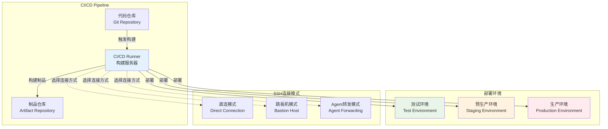

### CI/CD Runner的SSH配置需求

#### 1. 测试环境配置

**特点**: 频繁部署、快速迭代、相对宽松的安全要求

```bash
# CI/CD Runner的 ~/.ssh/config
Host test-*
    User deploy
    IdentityFile ~/.ssh/ci_test_key
    ForwardAgent no                     # 测试环境不需要Agent转发
    StrictHostKeyChecking no            # 测试环境可以自动接受新主机
    UserKnownHostsFile /dev/null        # 不保存主机指纹
    LogLevel ERROR                      # 减少日志输出
    ConnectTimeout 10                   # 快速超时
    ServerAliveInterval 30
    ServerAliveCountMax 2
```

**部署脚本示例**:
```bash
#!/bin/bash
# CI/CD测试环境部署脚本

set -e

# 设置SSH配置
export SSH_CONFIG="
Host test-server
    HostName test.example.com
    User deploy
    IdentityFile ~/.ssh/ci_test_key
    StrictHostKeyChecking no
    UserKnownHostsFile /dev/null
"

echo "$SSH_CONFIG" > ~/.ssh/config

# 部署应用
scp -r ./build/* test-server:/var/www/app/
ssh test-server "sudo systemctl restart app-service"

# 验证部署
ssh test-server "curl -f http://localhost:8080/health"
```

#### 2. 生产环境配置

**特点**: 严格安全要求、审计需求、稳定性优先

```bash
# CI/CD Runner的 ~/.ssh/config - 生产环境
Host prod-jumpserver
    HostName jump.prod.example.com
    User ci-deploy
    IdentityFile ~/.ssh/ci_prod_key
    ForwardAgent yes                    # 生产环境使用Agent转发
    StrictHostKeyChecking yes           # 严格验证主机指纹
    UserKnownHostsFile ~/.ssh/known_hosts_prod
    LogLevel INFO                       # 记录详细日志
    ConnectTimeout 30
    ServerAliveInterval 60
    ServerAliveCountMax 3

Host prod-web-*
    ProxyJump prod-jumpserver           # 通过跳板机连接
    User deploy
    IdentityFile ~/.ssh/ci_prod_key
    ForwardAgent yes
    StrictHostKeyChecking yes
    BatchMode yes                       # 非交互模式
```

### Agent Forwarding在CI/CD中的应用

#### 使用场景分析

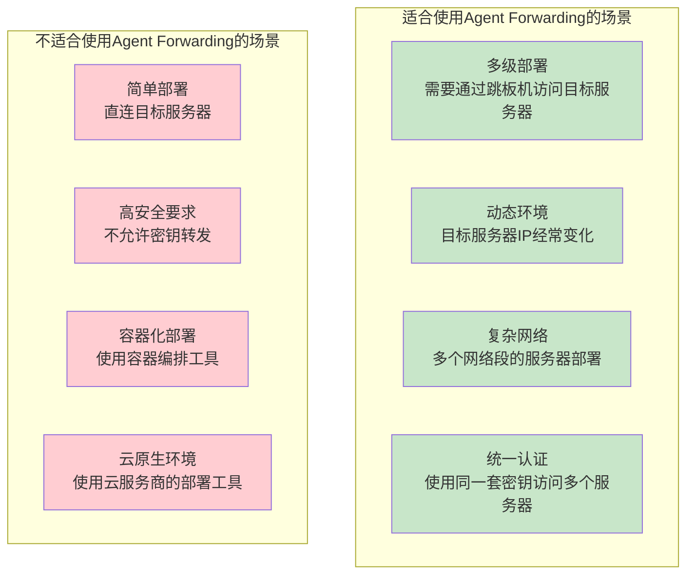

#### Agent Forwarding的替代方案

**1. 专用部署密钥**:
```bash
# 为每个环境生成专用密钥
ssh-keygen -t rsa -b 4096 -f ~/.ssh/deploy_test_key -N ""
ssh-keygen -t rsa -b 4096 -f ~/.ssh/deploy_prod_key -N ""

# 在目标服务器上配置authorized_keys
# 限制密钥只能执行特定命令
command="/usr/local/bin/deploy.sh",no-port-forwarding,no-X11-forwarding ssh-rsa AAAAB3... deploy@ci-server
```

**2. 容器化部署**:
```yaml
# Docker Compose部署示例
version: '3.8'
services:
  deploy:
    image: alpine/ssh
    volumes:
      - ./deploy_key:/root/.ssh/id_rsa:ro
      - ./ssh_config:/root/.ssh/config:ro
    command: |
      sh -c "
        chmod 600 /root/.ssh/id_rsa
        ssh-keyscan target-server >> /root/.ssh/known_hosts
        scp -r /app/* target-server:/var/www/
      "
```

**3. 云原生部署工具**:
```bash
# 使用云服务商的部署工具
# AWS CodeDeploy, Azure DevOps, Google Cloud Build等
# 这些工具通常有内置的安全认证机制
```

### 不同环境的安全配置策略

#### 环境分级安全策略

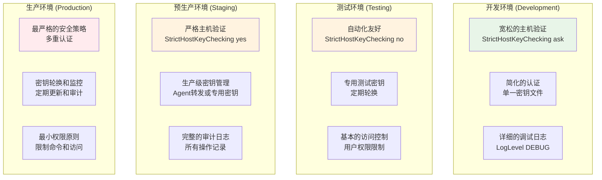

#### 具体配置示例

**开发环境配置**:
```bash
# ~/.ssh/config - 开发环境
Host dev-*
    User developer
    IdentityFile ~/.ssh/dev_key
    ForwardAgent yes
    StrictHostKeyChecking ask           # 询问未知主机
    LogLevel DEBUG                      # 详细日志便于调试
    ConnectTimeout 10
```

**测试环境配置**:
```bash
# ~/.ssh/config - 测试环境
Host test-*
    User ci-test
    IdentityFile ~/.ssh/test_key
    ForwardAgent no                     # 测试环境不需要转发
    StrictHostKeyChecking no            # 自动接受（测试环境）
    UserKnownHostsFile /dev/null        # 不保存主机指纹
    LogLevel ERROR                      # 只记录错误
    BatchMode yes                       # 非交互模式
```

**生产环境配置**:
```bash
# ~/.ssh/config - 生产环境
Host prod-*
    User deploy
    IdentityFile ~/.ssh/prod_key
    ForwardAgent yes                    # 通过跳板机需要转发
    StrictHostKeyChecking yes           # 严格验证
    UserKnownHostsFile ~/.ssh/known_hosts_prod
    LogLevel INFO                       # 记录操作日志
    ConnectTimeout 30                   # 较长的超时时间
    ServerAliveInterval 60              # 保持连接稳定
    BatchMode yes                       # 非交互模式
```

### CI/CD SSH最佳实践

#### 1. 密钥管理策略

```bash
# 密钥生成脚本
#!/bin/bash
# generate_ci_keys.sh

ENVIRONMENTS=("dev" "test" "staging" "prod")
KEY_SIZE=4096
KEY_TYPE="rsa"

for env in "${ENVIRONMENTS[@]}"; do
    echo "生成 $env 环境密钥..."
    ssh-keygen -t $KEY_TYPE -b $KEY_SIZE \
               -f ~/.ssh/ci_${env}_key \
               -N "" \
               -C "ci-system@${env}-environment"

    echo "密钥已生成: ~/.ssh/ci_${env}_key"
    echo "公钥内容:"
    cat ~/.ssh/ci_${env}_key.pub
    echo "---"
done
```

#### 2. 自动化部署脚本

```bash
#!/bin/bash
# deploy.sh - 通用部署脚本

set -euo pipefail

ENVIRONMENT=${1:-test}
APPLICATION=${2:-myapp}
VERSION=${3:-latest}

# 根据环境选择配置
case $ENVIRONMENT in
    "test")
        SSH_KEY="~/.ssh/ci_test_key"
        TARGET_HOSTS="test-web-01 test-web-02"
        DEPLOY_PATH="/var/www/test"
        ;;
    "prod")
        SSH_KEY="~/.ssh/ci_prod_key"
        TARGET_HOSTS="prod-web-01 prod-web-02 prod-web-03"
        DEPLOY_PATH="/var/www/production"
        ;;
    *)
        echo "未知环境: $ENVIRONMENT"
        exit 1
        ;;
esac

# 部署函数
deploy_to_host() {
    local host=$1
    echo "部署到 $host..."

    # 上传应用文件
    scp -i $SSH_KEY -r ./build/* $host:$DEPLOY_PATH/

    # 重启服务
    ssh -i $SSH_KEY $host "sudo systemctl restart $APPLICATION"

    # 健康检查
    ssh -i $SSH_KEY $host "curl -f http://localhost:8080/health"

    echo "$host 部署完成"
}

# 并行部署到所有主机
for host in $TARGET_HOSTS; do
    deploy_to_host $host &
done

# 等待所有部署完成
wait

echo "所有主机部署完成"
```

#### 3. 安全监控和审计

```bash
#!/bin/bash
# ssh_audit.sh - SSH连接审计脚本

LOG_FILE="/var/log/ci_ssh_audit.log"

# 记录SSH连接
log_ssh_connection() {
    local target=$1
    local user=$2
    local timestamp=$(date '+%Y-%m-%d %H:%M:%S')

    echo "[$timestamp] CI SSH连接: $user@$target" >> $LOG_FILE
}

# 监控SSH密钥使用
monitor_key_usage() {
    local key_file=$1
    local key_fingerprint=$(ssh-keygen -lf $key_file | awk '{print $2}')

    echo "监控密钥: $key_fingerprint"
    # 这里可以添加密钥使用监控逻辑
}

# 检查密钥权限
check_key_permissions() {
    find ~/.ssh -name "*.key" -o -name "id_*" | while read key; do
        if [[ -f "$key" && ! "$key" =~ \.pub$ ]]; then
            perms=$(stat -c %a "$key")
            if [[ "$perms" != "600" ]]; then
                echo "警告: $key 权限不正确 ($perms), 应该是 600"
            fi
        fi
    done
}

# 执行审计检查
log_ssh_connection "$@"
check_key_permissions
```

## 与SSH代理管理系统的协同工作

### 1. 启动时协同
- ZSH启动 → SSH代理管理器 → 启动/恢复代理
- SSH连接 → 读取客户端配置 → 使用代理转发

### 2. 密钥管理协同
- 密钥生成 → 自动添加到代理
- SSH连接 → AddKeysToAgent自动添加新密钥
- 代理持久化 → 12小时超时管理

### 3. 配置文件协同
- 服务器配置: AllowAgentForwarding yes
- 客户端配置: ForwardAgent yes
- 代理管理: 自动启动和密钥加载

## 最佳实践配置示例

### 基础配置 (适用于大多数场景)
```
# SSH Agent Forwarding Configuration
Host *
    ForwardAgent yes
    AddKeysToAgent yes
    IdentitiesOnly no
    ServerAliveInterval 60
    ServerAliveCountMax 3
    Compression yes
    TCPKeepAlive yes
```

### 高安全环境配置
```
# High Security SSH Configuration
Host production-*
    ForwardAgent no
    IdentitiesOnly yes
    IdentityFile ~/.ssh/production_key
    UserKnownHostsFile ~/.ssh/known_hosts_production
    StrictHostKeyChecking yes

Host development-*
    ForwardAgent yes
    AddKeysToAgent yes
    IdentitiesOnly no
    StrictHostKeyChecking ask
```

### 特定服务器配置
```
# Jump Server Configuration
Host jumpserver
    HostName jump.example.com
    User admin
    Port 2222
    ForwardAgent yes
    IdentityFile ~/.ssh/jump_key

# Target Server via Jump Server
Host target-server
    HostName 192.168.1.100
    User deploy
    ProxyJump jumpserver
    ForwardAgent yes
```

## 故障排除和最佳实践

### 常见问题诊断和解决方案

#### 1. Agent转发问题

**问题**: Agent转发不工作
```bash
# 诊断步骤
echo "=== 本地Agent状态 ==="
echo "SSH_AUTH_SOCK: $SSH_AUTH_SOCK"
ssh-add -l

echo "=== 连接测试 ==="
ssh -v jumpserver "echo \$SSH_AUTH_SOCK"
ssh -v jumpserver "ssh-add -l"

echo "=== 配置检查 ==="
grep -i forwardagent ~/.ssh/config
ssh jumpserver "grep -i allowagentforwarding /etc/ssh/sshd_config"
```

**解决方案**:
```bash
# 1. 确保本地Agent运行
eval $(ssh-agent -s)
ssh-add ~/.ssh/id_rsa

# 2. 检查配置文件
echo "ForwardAgent yes" >> ~/.ssh/config

# 3. 重启SSH服务（服务器端）
sudo systemctl restart ssh
```

#### 2. 权限和安全问题

**问题**: SSH权限错误
```bash
# 权限检查脚本
#!/bin/bash
check_ssh_permissions() {
    echo "=== SSH权限检查 ==="

    # 检查.ssh目录
    ssh_dir="$HOME/.ssh"
    if [[ -d "$ssh_dir" ]]; then
        perms=$(stat -c %a "$ssh_dir")
        echo ".ssh目录权限: $perms $([ "$perms" = "700" ] && echo "✓" || echo "✗ 应该是700")"
    fi

    # 检查配置文件
    config_file="$ssh_dir/config"
    if [[ -f "$config_file" ]]; then
        perms=$(stat -c %a "$config_file")
        echo "config文件权限: $perms $([ "$perms" = "600" ] && echo "✓" || echo "✗ 应该是600")"
    fi

    # 检查私钥文件
    find "$ssh_dir" -name "id_*" -not -name "*.pub" | while read key; do
        perms=$(stat -c %a "$key")
        echo "私钥 $(basename $key) 权限: $perms $([ "$perms" = "600" ] && echo "✓" || echo "✗ 应该是600")"
    done

    # 检查公钥文件
    find "$ssh_dir" -name "*.pub" | while read key; do
        perms=$(stat -c %a "$key")
        echo "公钥 $(basename $key) 权限: $perms $([ "$perms" = "644" ] && echo "✓" || echo "✗ 应该是644")"
    done
}

check_ssh_permissions
```

**自动修复脚本**:
```bash
#!/bin/bash
fix_ssh_permissions() {
    echo "=== 修复SSH权限 ==="

    # 修复.ssh目录权限
    chmod 700 ~/.ssh
    echo "已修复 .ssh 目录权限为 700"

    # 修复配置文件权限
    if [[ -f ~/.ssh/config ]]; then
        chmod 600 ~/.ssh/config
        echo "已修复 config 文件权限为 600"
    fi

    # 修复私钥权限
    find ~/.ssh -name "id_*" -not -name "*.pub" -exec chmod 600 {} \;
    echo "已修复所有私钥文件权限为 600"

    # 修复公钥权限
    find ~/.ssh -name "*.pub" -exec chmod 644 {} \;
    echo "已修复所有公钥文件权限为 644"

    # 修复authorized_keys权限
    if [[ -f ~/.ssh/authorized_keys ]]; then
        chmod 600 ~/.ssh/authorized_keys
        echo "已修复 authorized_keys 文件权限为 600"
    fi

    # 修复known_hosts权限
    if [[ -f ~/.ssh/known_hosts ]]; then
        chmod 644 ~/.ssh/known_hosts
        echo "已修复 known_hosts 文件权限为 644"
    fi
}

fix_ssh_permissions
```

#### 3. 连接和网络问题

**问题**: SSH连接超时或不稳定
```bash
# 网络连接诊断
#!/bin/bash
diagnose_ssh_connection() {
    local target=$1

    echo "=== SSH连接诊断: $target ==="

    # 1. 基本网络连通性
    echo "1. 网络连通性测试:"
    ping -c 3 $target

    # 2. SSH端口检查
    echo "2. SSH端口检查:"
    nc -zv $target 22

    # 3. SSH服务状态
    echo "3. SSH握手测试:"
    timeout 10 ssh -o ConnectTimeout=5 -o BatchMode=yes $target exit

    # 4. 详细连接日志
    echo "4. 详细连接日志:"
    ssh -vvv -o ConnectTimeout=10 $target exit 2>&1 | head -20
}

# 使用示例
diagnose_ssh_connection "jumpserver.example.com"
```

**连接优化配置**:
```bash
# ~/.ssh/config - 连接优化
Host *
    # 连接超时设置
    ConnectTimeout 30                   # 连接超时30秒
    ServerAliveInterval 60              # 每60秒发送保活
    ServerAliveCountMax 3               # 最多3次保活失败
    TCPKeepAlive yes                    # 启用TCP保活

    # 性能优化
    Compression yes                     # 启用压缩
    CompressionLevel 6                  # 压缩级别

    # 连接复用
    ControlMaster auto                  # 自动连接复用
    ControlPath ~/.ssh/sockets/%r@%h-%p # 连接复用socket路径
    ControlPersist 600                  # 连接保持10分钟

    # 认证优化
    PreferredAuthentications publickey,password
    PubkeyAuthentication yes
    PasswordAuthentication no
```

#### 4. 密钥管理问题

**问题**: 密钥不自动添加或管理混乱
```bash
# 密钥管理诊断脚本
#!/bin/bash
diagnose_key_management() {
    echo "=== SSH密钥管理诊断 ==="

    # 1. Agent状态
    echo "1. SSH Agent状态:"
    if [[ -n "$SSH_AUTH_SOCK" ]]; then
        echo "   SSH_AUTH_SOCK: $SSH_AUTH_SOCK"
        echo "   SSH_AGENT_PID: $SSH_AGENT_PID"
        echo "   Agent中的密钥:"
        ssh-add -l 2>/dev/null || echo "   Agent中无密钥"
    else
        echo "   SSH Agent未运行"
    fi

    # 2. 本地密钥文件
    echo "2. 本地密钥文件:"
    find ~/.ssh -name "id_*" -not -name "*.pub" | while read key; do
        echo "   私钥: $key"
        ssh-keygen -lf "$key" 2>/dev/null || echo "   无效的密钥文件"
    done

    # 3. 配置文件检查
    echo "3. 配置文件检查:"
    if [[ -f ~/.ssh/config ]]; then
        echo "   AddKeysToAgent: $(grep -i addkeystoagent ~/.ssh/config || echo "未配置")"
        echo "   IdentitiesOnly: $(grep -i identitiesonly ~/.ssh/config || echo "未配置")"
    else
        echo "   无SSH配置文件"
    fi
}

diagnose_key_management
```

### 高级故障排除技巧

#### 1. SSH连接调试

```bash
# 最详细的SSH调试
ssh -vvv -o LogLevel=DEBUG3 target-server

# 只显示关键信息
ssh -v target-server 2>&1 | grep -E "(debug1|Offering|Authentications|Agent)"

# 测试特定配置
ssh -F /dev/null -o StrictHostKeyChecking=no -i ~/.ssh/specific_key target-server
```

#### 2. Agent转发调试

```bash
# 检查Agent转发链
check_agent_forwarding() {
    local target=$1

    echo "=== Agent转发链检查 ==="
    echo "本地Agent: $(ssh-add -l | wc -l) 个密钥"

    ssh $target "
        echo '跳板机Agent: \$(ssh-add -l 2>/dev/null | wc -l) 个密钥'
        echo 'SSH_AUTH_SOCK: \$SSH_AUTH_SOCK'

        # 测试到目标服务器的连接
        ssh -o ConnectTimeout=5 target-server 'echo 目标服务器连接成功'
    "
}
```

#### 3. 配置文件验证

```bash
# SSH配置文件语法检查
ssh -F ~/.ssh/config -T git@github.com 2>&1 | head -5

# 测试特定Host配置
ssh -F ~/.ssh/config -o BatchMode=yes target-host exit
echo "退出码: $?"
```

### 安全最佳实践总结

#### 1. 密钥安全策略

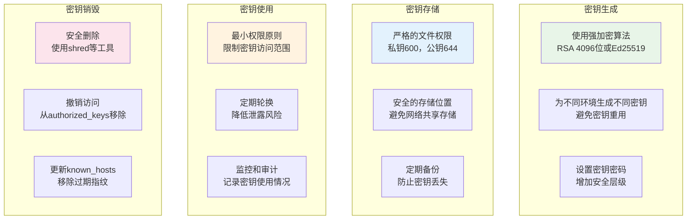

#### 2. 网络安全配置

```bash
# 服务器端安全配置模板
cat > /etc/ssh/sshd_config.secure << 'EOF'
# SSH安全配置模板
Port 22
Protocol 2

# 认证配置
PermitRootLogin no
PasswordAuthentication no
PubkeyAuthentication yes
AuthorizedKeysFile .ssh/authorized_keys
PermitEmptyPasswords no
ChallengeResponseAuthentication no

# 连接限制
MaxAuthTries 3
MaxSessions 10
MaxStartups 10:30:100
LoginGraceTime 60

# 转发配置
AllowAgentForwarding yes               # 根据需要调整
AllowTcpForwarding no                  # 限制端口转发
X11Forwarding no                       # 禁用X11转发
PermitTunnel no                        # 禁用隧道

# 保活配置
ClientAliveInterval 300
ClientAliveCountMax 2

# 用户限制
AllowUsers deploy admin                # 限制允许的用户
DenyUsers root guest                   # 禁止的用户

# 日志配置
SyslogFacility AUTH
LogLevel INFO

# 其他安全选项
UsePAM yes
UseDNS no                             # 禁用DNS查找提高性能
PermitUserEnvironment no              # 禁用用户环境变量
EOF
```

#### 3. 监控和审计

```bash
# SSH连接监控脚本
#!/bin/bash
monitor_ssh_connections() {
    echo "=== SSH连接监控 ==="

    # 当前SSH连接
    echo "当前SSH连接:"
    ss -tnp | grep :22

    # SSH登录日志
    echo "最近的SSH登录:"
    journalctl -u ssh -n 10 --no-pager

    # 失败的登录尝试
    echo "失败的登录尝试:"
    grep "Failed password" /var/log/auth.log | tail -5

    # Agent转发使用情况
    echo "Agent转发使用:"
    ps aux | grep ssh-agent
}

# 定期执行监控
monitor_ssh_connections
```

## 快速参考和总结

### SSH配置快速检查清单

```bash
# SSH配置健康检查脚本
#!/bin/bash
ssh_health_check() {
    echo "=== SSH配置健康检查 ==="

    local score=0
    local total=10

    # 1. SSH Agent状态
    if [[ -n "$SSH_AUTH_SOCK" ]] && ssh-add -l >/dev/null 2>&1; then
        echo "✓ SSH Agent运行正常"
        ((score++))
    else
        echo "✗ SSH Agent未运行或无密钥"
    fi

    # 2. 配置文件存在
    if [[ -f ~/.ssh/config ]]; then
        echo "✓ SSH配置文件存在"
        ((score++))
    else
        echo "✗ SSH配置文件不存在"
    fi

    # 3. 权限检查
    if [[ $(stat -c %a ~/.ssh) == "700" ]]; then
        echo "✓ .ssh目录权限正确"
        ((score++))
    else
        echo "✗ .ssh目录权限错误"
    fi

    # 4. Agent转发配置
    if grep -q "ForwardAgent yes" ~/.ssh/config 2>/dev/null; then
        echo "✓ Agent转发已启用"
        ((score++))
    else
        echo "✗ Agent转发未配置"
    fi

    # 5. 密钥文件权限
    local key_perms_ok=true
    find ~/.ssh -name "id_*" -not -name "*.pub" 2>/dev/null | while read key; do
        if [[ $(stat -c %a "$key") != "600" ]]; then
            key_perms_ok=false
            break
        fi
    done

    if $key_perms_ok; then
        echo "✓ 私钥文件权限正确"
        ((score++))
    else
        echo "✗ 私钥文件权限错误"
    fi

    # 6. 保活配置
    if grep -q "ServerAliveInterval" ~/.ssh/config 2>/dev/null; then
        echo "✓ 连接保活已配置"
        ((score++))
    else
        echo "✗ 连接保活未配置"
    fi

    # 7. 主机密钥验证
    if [[ -f ~/.ssh/known_hosts ]]; then
        echo "✓ known_hosts文件存在"
        ((score++))
    else
        echo "✗ known_hosts文件不存在"
    fi

    # 8. 密钥自动添加
    if grep -q "AddKeysToAgent yes" ~/.ssh/config 2>/dev/null; then
        echo "✓ 密钥自动添加已启用"
        ((score++))
    else
        echo "✗ 密钥自动添加未配置"
    fi

    # 9. 压缩配置
    if grep -q "Compression yes" ~/.ssh/config 2>/dev/null; then
        echo "✓ 数据压缩已启用"
        ((score++))
    else
        echo "✗ 数据压缩未配置"
    fi

    # 10. 连接复用
    if grep -q "ControlMaster" ~/.ssh/config 2>/dev/null; then
        echo "✓ 连接复用已配置"
        ((score++))
    else
        echo "✗ 连接复用未配置"
    fi

    echo "=== 健康评分: $score/$total ==="

    if [[ $score -ge 8 ]]; then
        echo "🎉 SSH配置优秀！"
    elif [[ $score -ge 6 ]]; then
        echo "👍 SSH配置良好，建议优化"
    else
        echo "⚠️  SSH配置需要改进"
    fi
}

ssh_health_check
```

### 常用命令速查表

```bash
# === SSH Agent管理 ===
eval $(ssh-agent -s)                   # 启动SSH Agent
ssh-add ~/.ssh/id_rsa                  # 添加密钥到Agent
ssh-add -l                             # 列出Agent中的密钥
ssh-add -D                             # 清空Agent中的所有密钥
ssh-add -t 3600 ~/.ssh/id_rsa          # 添加密钥并设置1小时超时

# === SSH连接测试 ===
ssh -v target-server                   # 详细连接日志
ssh -vvv target-server                 # 最详细连接日志
ssh -o ConnectTimeout=10 target-server # 设置连接超时
ssh -o BatchMode=yes target-server     # 非交互模式
ssh -A target-server                   # 启用Agent转发

# === 密钥管理 ===
ssh-keygen -t rsa -b 4096 -f ~/.ssh/new_key    # 生成新密钥
ssh-keygen -lf ~/.ssh/id_rsa                    # 显示密钥指纹
ssh-copy-id user@server                         # 复制公钥到服务器
ssh-keyscan server >> ~/.ssh/known_hosts        # 添加服务器指纹

# === 配置测试 ===
ssh -F ~/.ssh/config target-server             # 使用指定配置文件
ssh -o StrictHostKeyChecking=no target-server  # 跳过主机验证
ssh -i ~/.ssh/specific_key target-server       # 使用指定密钥

# === 故障排除 ===
ssh -T git@github.com                          # 测试GitHub连接
nc -zv server 22                               # 测试SSH端口
ping -c 3 server                               # 测试网络连通性
```

### 配置模板

#### 基础配置模板
```bash
# ~/.ssh/config - 基础配置
Host *
    ForwardAgent yes
    AddKeysToAgent yes
    ServerAliveInterval 60
    ServerAliveCountMax 3
    Compression yes
    TCPKeepAlive yes

    # 连接复用
    ControlMaster auto
    ControlPath ~/.ssh/sockets/%r@%h-%p
    ControlPersist 600
```

#### 企业环境配置模板
```bash
# ~/.ssh/config - 企业环境
# 跳板机配置
Host jumpserver
    HostName jump.company.com
    User admin
    Port 22
    ForwardAgent yes
    IdentityFile ~/.ssh/company_key
    StrictHostKeyChecking yes

# 生产环境（通过跳板机）
Host prod-*
    ProxyJump jumpserver
    User deploy
    ForwardAgent yes
    IdentityFile ~/.ssh/company_key
    StrictHostKeyChecking yes
    LogLevel INFO

# 开发环境（直连）
Host dev-*
    User developer
    ForwardAgent yes
    IdentityFile ~/.ssh/dev_key
    StrictHostKeyChecking ask
```

### 安全配置检查脚本

```bash
#!/bin/bash
# security_audit.sh - SSH安全审计脚本

audit_ssh_security() {
    echo "=== SSH安全审计 ==="

    # 检查服务器配置
    echo "1. 服务器配置检查:"
    local sshd_config="/etc/ssh/sshd_config"

    if [[ -f "$sshd_config" ]]; then
        echo "   PasswordAuthentication: $(grep "^PasswordAuthentication" $sshd_config || echo "未配置")"
        echo "   PermitRootLogin: $(grep "^PermitRootLogin" $sshd_config || echo "未配置")"
        echo "   AllowAgentForwarding: $(grep "^AllowAgentForwarding" $sshd_config || echo "未配置")"
        echo "   MaxAuthTries: $(grep "^MaxAuthTries" $sshd_config || echo "未配置")"
    fi

    # 检查客户端配置
    echo "2. 客户端配置检查:"
    if [[ -f ~/.ssh/config ]]; then
        echo "   ForwardAgent: $(grep -i "ForwardAgent" ~/.ssh/config | head -1 || echo "未配置")"
        echo "   StrictHostKeyChecking: $(grep -i "StrictHostKeyChecking" ~/.ssh/config | head -1 || echo "未配置")"
    fi

    # 检查密钥强度
    echo "3. 密钥强度检查:"
    find ~/.ssh -name "id_*" -not -name "*.pub" 2>/dev/null | while read key; do
        local key_info=$(ssh-keygen -lf "$key" 2>/dev/null)
        if [[ -n "$key_info" ]]; then
            local bits=$(echo "$key_info" | awk '{print $1}')
            local type=$(echo "$key_info" | awk '{print $4}' | tr -d '()')
            echo "   $(basename $key): $bits位 $type $([ $bits -ge 2048 ] && echo "✓" || echo "✗ 强度不足")"
        fi
    done

    # 检查authorized_keys
    echo "4. authorized_keys检查:"
    if [[ -f ~/.ssh/authorized_keys ]]; then
        local key_count=$(wc -l < ~/.ssh/authorized_keys)
        echo "   授权密钥数量: $key_count"

        # 检查是否有限制选项
        if grep -q "command=" ~/.ssh/authorized_keys; then
            echo "   ✓ 发现命令限制"
        else
            echo "   ⚠️  无命令限制"
        fi
    fi
}

audit_ssh_security
```

## 总结

本文档详细介绍了SSH客户端配置文件的各个方面，从基础概念到高级应用，涵盖了：

### 🎯 核心内容
1. **三层SSH架构** - 本地主机、跳板机、目标服务器的完整配置
2. **密钥和配置文件分析** - 各节点的文件作用和管理策略
3. **Agent Forwarding机制** - 详细的工作流程和安全考虑
4. **CI/CD环境配置** - 自动化部署中的SSH配置最佳实践
5. **故障排除指南** - 常见问题的诊断和解决方案

### 🔧 实用工具
- 配置健康检查脚本
- 权限修复脚本
- 安全审计脚本
- 连接诊断工具
- 配置模板

### 🛡️ 安全最佳实践
- 密钥生成和管理策略
- 权限设置和访问控制
- 网络安全配置
- 监控和审计机制

通过遵循本文档的指导，您可以建立一个安全、高效、易维护的SSH连接环境，实现真正的"一次配置，永久使用"的目标。
