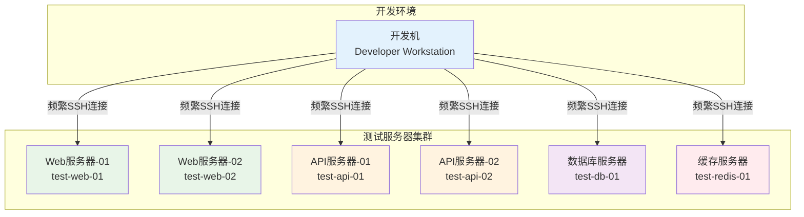
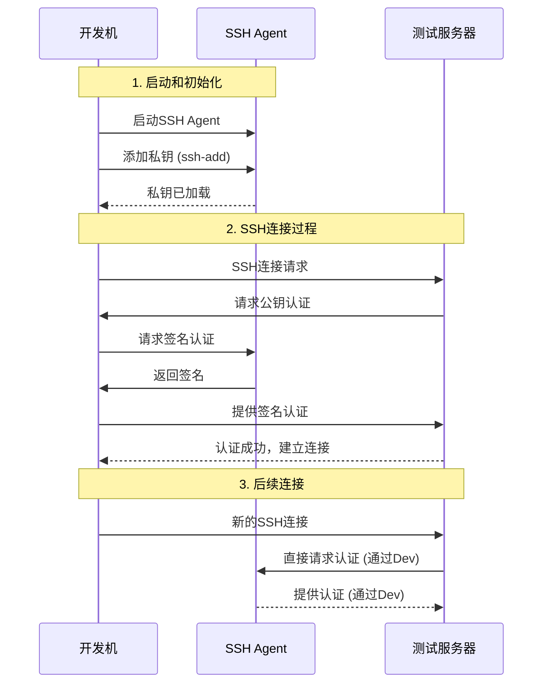
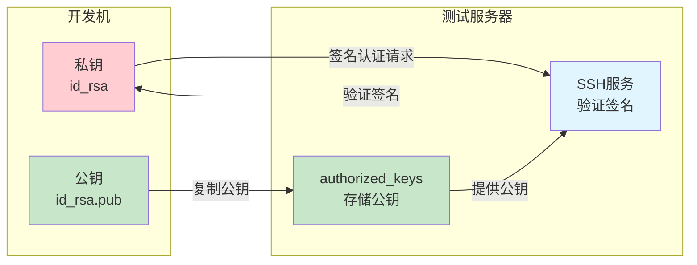
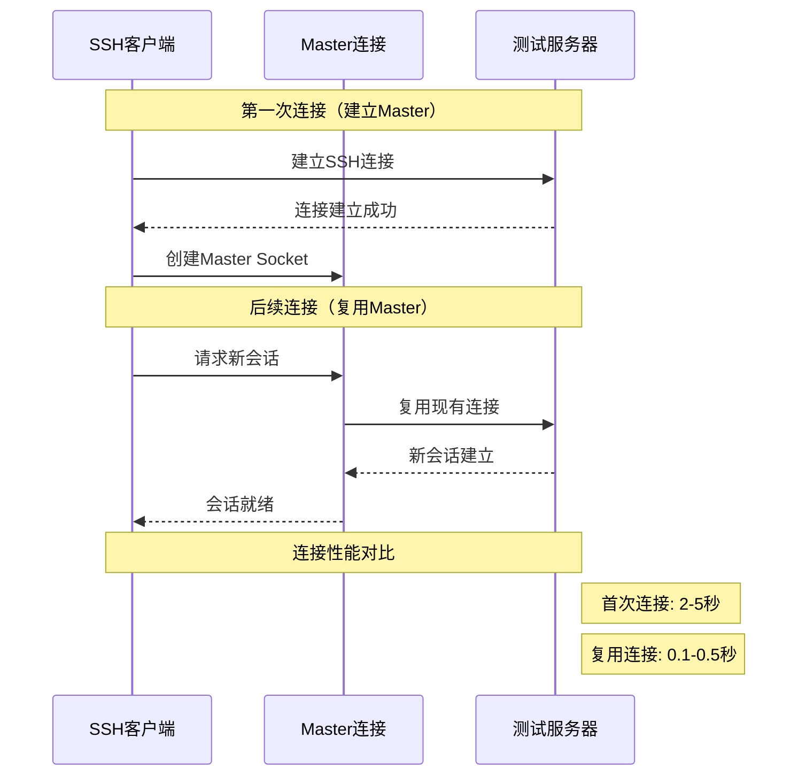

# 开发机到测试服务器集群的免密SSH连接方案

## 目录
- [场景描述](#场景描述)
- [方案对比](#方案对比)
- [方案一：SSH Agent方案](#方案一ssh-agent方案)
- [方案二：SSH密钥对直接认证方案](#方案二ssh密钥对直接认证方案)
- [方案三：SSH配置文件优化方案](#方案三ssh配置文件优化方案)
- [方案四：SSH连接复用方案](#方案四ssh连接复用方案)
- [方案五：自动化密钥管理方案](#方案五自动化密钥管理方案)
- [性能对比与选择建议](#性能对比与选择建议)
- [故障排除指南](#故障排除指南)
- [最佳实践总结](#最佳实践总结)

## 场景描述

### 典型使用场景

在现代软件开发环境中，开发人员经常需要从本地开发机连接到多个测试服务器进行以下操作：



**常见操作场景：**
1. **代码部署**：将最新代码部署到测试服务器
2. **日志查看**：实时查看应用程序和系统日志
3. **服务管理**：启动、停止、重启各种服务
4. **配置调试**：修改配置文件并测试效果
5. **性能监控**：检查系统资源使用情况
6. **数据库操作**：执行SQL查询和数据维护
7. **文件传输**：上传下载配置文件和数据文件

### 当前痛点分析

**1. 重复输入密码**
```bash
# 传统方式需要频繁输入密码
ssh user@test-web-01    # 输入密码
ssh user@test-api-01    # 再次输入密码
ssh user@test-db-01     # 又要输入密码
```

**2. 连接建立耗时**
- 每次SSH连接都需要完整的握手过程
- TCP连接建立 + SSH协议协商 + 认证过程
- 平均每次连接耗时2-5秒

**3. 管理复杂性**
- 多个服务器的不同用户名和端口
- 记忆困难的IP地址和主机名
- 不同服务器可能有不同的认证要求

**4. 安全风险**
- 密码可能被肩窥或键盘记录
- 弱密码或密码重用的风险
- 缺乏统一的访问控制和审计

**5. 效率低下**
```bash
# 典型的低效工作流程
ssh test-web-01         # 输入密码，等待连接
tail -f /var/log/app.log # 查看日志
exit                     # 退出连接

ssh test-api-01         # 再次输入密码，等待连接
systemctl restart api   # 重启服务
exit                     # 退出连接

ssh test-db-01          # 第三次输入密码
mysql -u app -p         # 又要输入数据库密码
```

## 方案对比

### 方案概览对比表

| 方案 | 安全性 | 易用性 | 性能 | 维护成本 | 适用场景 |
|------|--------|--------|------|----------|----------|
| SSH Agent | ⭐⭐⭐⭐⭐ | ⭐⭐⭐⭐ | ⭐⭐⭐ | ⭐⭐⭐ | 开发环境，需要代理转发 |
| 密钥对直接认证 | ⭐⭐⭐⭐ | ⭐⭐⭐⭐⭐ | ⭐⭐⭐⭐ | ⭐⭐ | 简单环境，固定服务器 |
| 配置文件优化 | ⭐⭐⭐ | ⭐⭐⭐⭐⭐ | ⭐⭐⭐⭐ | ⭐⭐⭐⭐ | 复杂环境，多服务器管理 |
| 连接复用 | ⭐⭐⭐ | ⭐⭐⭐⭐ | ⭐⭐⭐⭐⭐ | ⭐⭐⭐ | 频繁连接，性能要求高 |
| 自动化管理 | ⭐⭐⭐⭐ | ⭐⭐⭐⭐⭐ | ⭐⭐⭐⭐ | ⭐⭐⭐⭐⭐ | 大规模环境，团队协作 |

### 技术特性对比


## 方案一：SSH Agent方案

### 技术原理

SSH Agent是一个后台程序，负责管理SSH私钥并为SSH客户端提供认证服务。它的核心优势是私钥只需要加载一次，后续所有SSH连接都可以通过Agent进行认证。



### 配置步骤

#### 开发机配置

**1. 启动SSH Agent**
```bash
# 方法一：手动启动
eval $(ssh-agent -s)
echo "SSH Agent PID: $SSH_AGENT_PID"
echo "SSH Auth Sock: $SSH_AUTH_SOCK"

# 方法二：自动启动（添加到 ~/.bashrc 或 ~/.zshrc）
if [ -z "$SSH_AUTH_SOCK" ]; then
    eval $(ssh-agent -s)
fi
```

**2. 生成和添加SSH密钥**
```bash
# 生成专用的测试环境密钥
ssh-keygen -t rsa -b 4096 -f ~/.ssh/id_rsa_test -C "test-environment-key"

# 添加私钥到Agent
ssh-add ~/.ssh/id_rsa_test

# 验证密钥已添加
ssh-add -l
# 输出示例：
# 4096 SHA256:abc123... ~/.ssh/id_rsa_test (RSA)
```

**3. 配置SSH客户端**
```bash
# ~/.ssh/config
Host test-*
    User testuser
    IdentityFile ~/.ssh/id_rsa_test
    AddKeysToAgent yes          # 自动添加密钥到Agent
    UseKeychain yes             # macOS上使用钥匙串
    ForwardAgent yes            # 启用Agent转发
```

#### 测试服务器配置

**1. 部署公钥到所有测试服务器**
```bash
# 方法一：使用ssh-copy-id（推荐）
ssh-copy-id -i ~/.ssh/id_rsa_test.pub testuser@test-web-01
ssh-copy-id -i ~/.ssh/id_rsa_test.pub testuser@test-api-01
ssh-copy-id -i ~/.ssh/id_rsa_test.pub testuser@test-db-01

# 方法二：批量部署脚本
#!/bin/bash
# deploy_keys.sh
SERVERS=(
    "test-web-01"
    "test-web-02"
    "test-api-01"
    "test-api-02"
    "test-db-01"
    "test-redis-01"
)

PUBLIC_KEY=$(cat ~/.ssh/id_rsa_test.pub)

for server in "${SERVERS[@]}"; do
    echo "部署公钥到 $server..."
    ssh testuser@$server "
        mkdir -p ~/.ssh
        chmod 700 ~/.ssh
        echo '$PUBLIC_KEY' >> ~/.ssh/authorized_keys
        chmod 600 ~/.ssh/authorized_keys
        echo '公钥已添加到 $server'
    "
done
```

**2. 服务器端SSH配置优化**
```bash
# /etc/ssh/sshd_config
PubkeyAuthentication yes
AuthorizedKeysFile .ssh/authorized_keys
PasswordAuthentication no           # 禁用密码认证（可选）
AllowAgentForwarding yes           # 允许Agent转发
ClientAliveInterval 60             # 保持连接活跃
ClientAliveCountMax 3
```

### 高级特性：Agent转发

Agent转发允许在跳板机上使用本地的SSH Agent，实现多级SSH连接：

```bash
# ~/.ssh/config - 跳板机配置
Host jumpserver
    HostName jump.test.com
    User admin
    ForwardAgent yes
    IdentityFile ~/.ssh/id_rsa_test

Host test-internal-*
    ProxyJump jumpserver           # 通过跳板机连接
    User testuser
    ForwardAgent yes
    IdentityFile ~/.ssh/id_rsa_test
```

### 优缺点分析

**优势：**
- ✅ **安全性高**：私钥只存储在本地，不会传输到远程服务器
- ✅ **一次认证**：密钥加载到Agent后，所有连接都无需重新输入密码
- ✅ **支持代理转发**：可以通过跳板机访问内网服务器
- ✅ **密钥管理集中**：所有密钥在Agent中统一管理

**劣势：**
- ❌ **依赖Agent进程**：Agent崩溃会影响所有SSH连接
- ❌ **会话绑定**：Agent只在当前会话中有效
- ❌ **内存占用**：Agent需要常驻内存
- ❌ **配置复杂**：需要正确配置Agent转发

## 方案二：SSH密钥对直接认证方案

### 技术原理

SSH密钥对认证是最直接的免密认证方式，通过在客户端生成密钥对，将公钥部署到服务器，实现基于公钥加密的身份认证。



### 配置步骤

#### 开发机配置

**1. 生成密钥对**
```bash
# 为测试环境生成专用密钥对
ssh-keygen -t ed25519 -f ~/.ssh/id_ed25519_test -C "test-servers-$(whoami)@$(hostname)"

# 或使用RSA密钥（兼容性更好）
ssh-keygen -t rsa -b 4096 -f ~/.ssh/id_rsa_test -C "test-servers-$(whoami)@$(hostname)"

# 设置合适的权限
chmod 600 ~/.ssh/id_*_test
chmod 644 ~/.ssh/id_*_test.pub
```

**2. 配置SSH客户端**
```bash
# ~/.ssh/config
# 测试环境服务器配置
Host test-web-01
    HostName 192.168.1.101
    User testuser
    Port 22
    IdentityFile ~/.ssh/id_ed25519_test
    IdentitiesOnly yes             # 只使用指定的密钥文件

Host test-web-02
    HostName 192.168.1.102
    User testuser
    Port 22
    IdentityFile ~/.ssh/id_ed25519_test
    IdentitiesOnly yes

Host test-api-01
    HostName 192.168.1.201
    User apiuser
    Port 2222                      # 非标准端口
    IdentityFile ~/.ssh/id_ed25519_test
    IdentitiesOnly yes

# 通配符配置（简化配置）
Host test-*
    User testuser
    IdentityFile ~/.ssh/id_ed25519_test
    IdentitiesOnly yes
    StrictHostKeyChecking ask      # 首次连接时询问
    UserKnownHostsFile ~/.ssh/known_hosts_test
```

#### 测试服务器配置

**1. 自动化公钥部署脚本**
```bash
#!/bin/bash
# deploy_public_keys.sh - 自动化公钥部署脚本

set -euo pipefail

# 配置变量
PUBLIC_KEY_FILE="$HOME/.ssh/id_ed25519_test.pub"
SERVERS_CONFIG="servers.txt"

# 检查公钥文件是否存在
if [[ ! -f "$PUBLIC_KEY_FILE" ]]; then
    echo "错误：公钥文件不存在 $PUBLIC_KEY_FILE"
    exit 1
fi

# 读取公钥内容
PUBLIC_KEY=$(cat "$PUBLIC_KEY_FILE")

# 服务器列表配置文件格式：hostname:port:username
# 示例：test-web-01:22:testuser
cat > "$SERVERS_CONFIG" << 'EOF'
test-web-01:22:testuser
test-web-02:22:testuser
test-api-01:2222:apiuser
test-api-02:2222:apiuser
test-db-01:22:dbuser
test-redis-01:22:redisuser
EOF

# 部署公钥到所有服务器
while IFS=':' read -r hostname port username; do
    echo "正在部署公钥到 $hostname:$port (用户: $username)..."

    # 使用sshpass或手动输入密码
    ssh -p "$port" "$username@$hostname" "
        # 创建.ssh目录
        mkdir -p ~/.ssh
        chmod 700 ~/.ssh

        # 添加公钥到authorized_keys
        echo '$PUBLIC_KEY' >> ~/.ssh/authorized_keys

        # 去重并设置权限
        sort ~/.ssh/authorized_keys | uniq > ~/.ssh/authorized_keys.tmp
        mv ~/.ssh/authorized_keys.tmp ~/.ssh/authorized_keys
        chmod 600 ~/.ssh/authorized_keys

        echo '公钥部署完成'
    "

    if [[ $? -eq 0 ]]; then
        echo "✅ $hostname 部署成功"
    else
        echo "❌ $hostname 部署失败"
    fi

done < "$SERVERS_CONFIG"

echo "公钥部署完成！"
```

**2. 服务器安全配置**
```bash
# /etc/ssh/sshd_config - 安全配置模板
Port 22                            # 或使用非标准端口
Protocol 2
PermitRootLogin no                 # 禁止root登录
PasswordAuthentication no          # 禁用密码认证
PubkeyAuthentication yes           # 启用公钥认证
AuthorizedKeysFile .ssh/authorized_keys
PermitEmptyPasswords no
ChallengeResponseAuthentication no
UsePAM yes
X11Forwarding no                   # 禁用X11转发
PrintMotd no
AcceptEnv LANG LC_*
Subsystem sftp /usr/lib/openssh/sftp-server

# 连接限制
MaxAuthTries 3
MaxSessions 10
MaxStartups 10:30:100
LoginGraceTime 60

# 保活设置
ClientAliveInterval 300
ClientAliveCountMax 2

# 用户限制（根据需要调整）
AllowUsers testuser apiuser dbuser redisuser
```

### 密钥轮换策略

```bash
#!/bin/bash
# rotate_ssh_keys.sh - SSH密钥轮换脚本

CURRENT_DATE=$(date +%Y%m%d)
BACKUP_DIR="$HOME/.ssh/backup/$CURRENT_DATE"
NEW_KEY_NAME="id_ed25519_test_$CURRENT_DATE"

echo "开始SSH密钥轮换..."

# 1. 备份当前密钥
mkdir -p "$BACKUP_DIR"
cp ~/.ssh/id_ed25519_test* "$BACKUP_DIR/"
echo "当前密钥已备份到 $BACKUP_DIR"

# 2. 生成新密钥
ssh-keygen -t ed25519 -f ~/.ssh/$NEW_KEY_NAME -C "test-servers-rotated-$CURRENT_DATE"
echo "新密钥已生成: ~/.ssh/$NEW_KEY_NAME"

# 3. 部署新公钥到所有服务器
echo "部署新公钥到服务器..."
# 这里可以调用之前的部署脚本

# 4. 测试新密钥
echo "测试新密钥连接..."
ssh -i ~/.ssh/$NEW_KEY_NAME -o ConnectTimeout=10 testuser@test-web-01 "echo '新密钥连接成功'"

# 5. 更新配置文件
sed -i.bak "s/id_ed25519_test/$NEW_KEY_NAME/g" ~/.ssh/config
echo "SSH配置文件已更新"

# 6. 清理旧密钥（可选，建议手动执行）
echo "密钥轮换完成！"
echo "旧密钥备份在: $BACKUP_DIR"
echo "请手动验证所有连接正常后，删除旧密钥"
```

### 优缺点分析

**优势：**
- ✅ **简单直接**：配置简单，易于理解和维护
- ✅ **性能最佳**：直接认证，无额外开销
- ✅ **稳定可靠**：不依赖额外的进程或服务
- ✅ **兼容性好**：所有SSH客户端都支持

**劣势：**
- ❌ **密钥管理复杂**：多个服务器需要同步密钥
- ❌ **安全风险**：私钥文件存储在磁盘上
- ❌ **轮换困难**：密钥轮换需要更新所有服务器
- ❌ **缺乏集中控制**：难以统一管理和审计

## 方案三：SSH配置文件优化方案

### 技术原理

通过优化SSH客户端配置文件（~/.ssh/config），可以显著简化SSH连接过程，提高连接效率，并实现统一的连接管理。

### 高级配置示例

```bash
# ~/.ssh/config - 完整的测试环境配置
# 全局默认配置
Host *
    ServerAliveInterval 60
    ServerAliveCountMax 3
    TCPKeepAlive yes
    Compression yes
    HashKnownHosts yes

    # 连接优化
    ConnectTimeout 10
    ConnectionAttempts 3

    # 安全设置
    StrictHostKeyChecking ask
    VisualHostKey yes

# 测试环境基础配置
Host test-*
    User testuser
    IdentityFile ~/.ssh/id_ed25519_test
    IdentitiesOnly yes
    Port 22

    # 测试环境特定设置
    StrictHostKeyChecking no        # 测试环境可以放宽
    UserKnownHostsFile ~/.ssh/known_hosts_test
    LogLevel INFO

# Web服务器集群
Host test-web-*
    User webuser
    Port 8022

    # Web服务器特定配置
    RemoteForward 9000 localhost:9000  # 端口转发用于调试
    LocalForward 3000 localhost:3000   # 本地端口转发

# API服务器集群
Host test-api-*
    User apiuser
    Port 2222

    # API服务器优化
    Compression yes
    CompressionLevel 6

# 数据库服务器
Host test-db-*
    User dbuser
    Port 3306

    # 数据库连接优化
    LocalForward 3306 localhost:3306   # MySQL端口转发
    ExitOnForwardFailure yes

# 具体服务器配置
Host test-web-01
    HostName 192.168.1.101

Host test-web-02
    HostName 192.168.1.102

Host test-api-01
    HostName 192.168.1.201

Host test-api-02
    HostName 192.168.1.202

Host test-db-01
    HostName 192.168.1.301

Host test-redis-01
    HostName 192.168.1.401
    User redisuser
    Port 6379

# 跳板机配置
Host jumpserver
    HostName jump.test.com
    User admin
    Port 22
    ForwardAgent yes

# 通过跳板机访问内网服务器
Host internal-*
    ProxyJump jumpserver
    User testuser
    StrictHostKeyChecking yes

# 开发环境快捷方式
Host dev
    HostName dev.test.com
    User developer
    Port 22

# 生产环境（只读访问）
Host prod-readonly
    HostName prod.example.com
    User readonly
    Port 22
    IdentityFile ~/.ssh/id_rsa_prod_readonly
    StrictHostKeyChecking yes
    UserKnownHostsFile ~/.ssh/known_hosts_prod
```

### 配置文件管理工具

```bash
#!/bin/bash
# ssh_config_manager.sh - SSH配置文件管理工具

CONFIG_FILE="$HOME/.ssh/config"
BACKUP_DIR="$HOME/.ssh/config_backups"
TEMPLATE_DIR="$HOME/.ssh/config_templates"

# 创建必要的目录
mkdir -p "$BACKUP_DIR" "$TEMPLATE_DIR"

# 备份当前配置
backup_config() {
    local timestamp=$(date +%Y%m%d_%H%M%S)
    local backup_file="$BACKUP_DIR/config_$timestamp"

    if [[ -f "$CONFIG_FILE" ]]; then
        cp "$CONFIG_FILE" "$backup_file"
        echo "配置已备份到: $backup_file"
    else
        echo "配置文件不存在，无需备份"
    fi
}

# 生成测试环境配置模板
generate_test_template() {
    cat > "$TEMPLATE_DIR/test_environment.conf" << 'EOF'
# 测试环境SSH配置模板
Host test-*
    User testuser
    IdentityFile ~/.ssh/id_ed25519_test
    IdentitiesOnly yes
    StrictHostKeyChecking no
    UserKnownHostsFile ~/.ssh/known_hosts_test
    ServerAliveInterval 60
    ServerAliveCountMax 3
    ConnectTimeout 10

# Web服务器集群
Host test-web-01
    HostName 192.168.1.101
    Port 8022

Host test-web-02
    HostName 192.168.1.102
    Port 8022

# API服务器集群
Host test-api-01
    HostName 192.168.1.201
    Port 2222
    User apiuser

Host test-api-02
    HostName 192.168.1.202
    Port 2222
    User apiuser
EOF
    echo "测试环境模板已生成: $TEMPLATE_DIR/test_environment.conf"
}

# 验证配置文件语法
validate_config() {
    local config_file=${1:-$CONFIG_FILE}

    echo "验证SSH配置文件: $config_file"

    # 使用ssh命令验证配置语法
    if ssh -F "$config_file" -T git@github.com 2>&1 | grep -q "Hi\|Permission denied"; then
        echo "✅ 配置文件语法正确"
        return 0
    else
        echo "❌ 配置文件可能有语法错误"
        return 1
    fi
}

# 应用配置模板
apply_template() {
    local template_name=$1
    local template_file="$TEMPLATE_DIR/${template_name}.conf"

    if [[ ! -f "$template_file" ]]; then
        echo "错误：模板文件不存在 $template_file"
        return 1
    fi

    backup_config
    cp "$template_file" "$CONFIG_FILE"
    chmod 600 "$CONFIG_FILE"

    echo "已应用配置模板: $template_name"
    validate_config
}

# 主菜单
case "${1:-menu}" in
    backup)
        backup_config
        ;;
    template)
        generate_test_template
        ;;
    validate)
        validate_config "$2"
        ;;
    apply)
        apply_template "$2"
        ;;
    *)
        echo "SSH配置管理工具"
        echo "用法: $0 {backup|template|validate|apply}"
        echo "  backup          - 备份当前配置"
        echo "  template        - 生成配置模板"
        echo "  validate [file] - 验证配置文件"
        echo "  apply <name>    - 应用配置模板"
        ;;
esac
```

### 优缺点分析

**优势：**
- ✅ **统一管理**：所有连接配置集中在一个文件中
- ✅ **简化命令**：复杂的连接参数通过别名简化
- ✅ **版本控制**：配置文件可以纳入版本控制系统
- ✅ **灵活配置**：支持通配符和继承配置

**劣势：**
- ❌ **配置复杂**：高级功能需要深入了解SSH配置选项
- ❌ **调试困难**：配置错误可能导致连接失败
- ❌ **平台差异**：不同操作系统的SSH客户端可能有差异

## 方案四：SSH连接复用方案

### 技术原理

SSH连接复用（Connection Multiplexing）通过ControlMaster功能，允许多个SSH会话共享同一个网络连接，显著减少连接建立时间和资源消耗。



### 配置步骤

#### 基础连接复用配置

```bash
# ~/.ssh/config - 连接复用配置
# 创建socket目录
Host *
    # 连接复用配置
    ControlMaster auto
    ControlPath ~/.ssh/sockets/%r@%h-%p
    ControlPersist 600                 # 连接保持10分钟

    # 性能优化
    Compression yes
    ServerAliveInterval 60
    ServerAliveCountMax 3

# 测试环境专用配置
Host test-*
    User testuser
    IdentityFile ~/.ssh/id_ed25519_test
    ControlMaster auto
    ControlPath ~/.ssh/sockets/test-%r@%h-%p
    ControlPersist 1800               # 测试环境保持30分钟

    # 测试环境优化
    StrictHostKeyChecking no
    UserKnownHostsFile ~/.ssh/known_hosts_test
    ConnectTimeout 5                  # 快速超时
```

#### 高级连接复用管理

```bash
#!/bin/bash
# ssh_connection_manager.sh - SSH连接复用管理工具

SOCKET_DIR="$HOME/.ssh/sockets"
CONFIG_FILE="$HOME/.ssh/config"

# 创建socket目录
mkdir -p "$SOCKET_DIR"
chmod 700 "$SOCKET_DIR"

# 列出所有活跃的连接
list_connections() {
    echo "活跃的SSH连接复用会话："
    echo "================================"

    if [[ -d "$SOCKET_DIR" ]]; then
        for socket in "$SOCKET_DIR"/*; do
            if [[ -S "$socket" ]]; then
                local socket_name=$(basename "$socket")
                local connection_info=$(echo "$socket_name" | sed 's/-/ /g')
                echo "🔗 $connection_info"

                # 检查连接状态
                if ssh -O check -S "$socket" dummy 2>/dev/null; then
                    echo "   状态: ✅ 活跃"
                else
                    echo "   状态: ❌ 断开"
                fi

                # 显示连接统计
                local stats=$(ssh -O check -S "$socket" dummy 2>&1 | grep -o '[0-9]* channels')
                echo "   会话: $stats"
                echo ""
            fi
        done
    else
        echo "没有找到活跃的连接"
    fi
}

# 建立预连接
establish_preconnections() {
    local servers=(
        "test-web-01"
        "test-web-02"
        "test-api-01"
        "test-api-02"
        "test-db-01"
    )

    echo "建立预连接到测试服务器..."

    for server in "${servers[@]}"; do
        echo "连接到 $server..."

        # 在后台建立连接
        ssh -fN "$server" 2>/dev/null &

        # 等待连接建立
        sleep 1

        # 检查连接状态
        if ssh -O check "$server" 2>/dev/null; then
            echo "✅ $server 预连接成功"
        else
            echo "❌ $server 预连接失败"
        fi
    done
}

# 关闭指定连接
close_connection() {
    local target=$1

    if [[ -z "$target" ]]; then
        echo "用法: close_connection <host>"
        return 1
    fi

    echo "关闭到 $target 的连接..."

    if ssh -O exit "$target" 2>/dev/null; then
        echo "✅ 连接已关闭"
    else
        echo "❌ 连接关闭失败或连接不存在"
    fi
}

# 关闭所有连接
close_all_connections() {
    echo "关闭所有SSH连接复用会话..."

    for socket in "$SOCKET_DIR"/*; do
        if [[ -S "$socket" ]]; then
            local socket_name=$(basename "$socket")
            echo "关闭 $socket_name..."

            # 尝试优雅关闭
            ssh -O exit -S "$socket" dummy 2>/dev/null || rm -f "$socket"
        fi
    done

    echo "所有连接已关闭"
}

# 连接性能测试
performance_test() {
    local target=${1:-test-web-01}
    local iterations=${2:-5}

    echo "SSH连接性能测试"
    echo "目标服务器: $target"
    echo "测试次数: $iterations"
    echo "=========================="

    # 测试首次连接时间
    echo "测试首次连接时间..."
    close_connection "$target" >/dev/null 2>&1

    local start_time=$(date +%s.%N)
    ssh "$target" "echo 'Connection test'" >/dev/null 2>&1
    local end_time=$(date +%s.%N)
    local first_connection_time=$(echo "$end_time - $start_time" | bc)

    echo "首次连接时间: ${first_connection_time}s"

    # 测试复用连接时间
    echo "测试连接复用时间..."
    local total_time=0

    for ((i=1; i<=iterations; i++)); do
        start_time=$(date +%s.%N)
        ssh "$target" "echo 'Reuse test $i'" >/dev/null 2>&1
        end_time=$(date +%s.%N)
        local reuse_time=$(echo "$end_time - $start_time" | bc)
        total_time=$(echo "$total_time + $reuse_time" | bc)
        echo "第${i}次复用: ${reuse_time}s"
    done

    local avg_reuse_time=$(echo "scale=3; $total_time / $iterations" | bc)
    local speedup=$(echo "scale=1; $first_connection_time / $avg_reuse_time" | bc)

    echo "=========================="
    echo "平均复用时间: ${avg_reuse_time}s"
    echo "性能提升: ${speedup}x"
}

# 主菜单
case "${1:-menu}" in
    list)
        list_connections
        ;;
    preconnect)
        establish_preconnections
        ;;
    close)
        close_connection "$2"
        ;;
    closeall)
        close_all_connections
        ;;
    test)
        performance_test "$2" "$3"
        ;;
    *)
        echo "SSH连接复用管理工具"
        echo "用法: $0 {list|preconnect|close|closeall|test}"
        echo "  list                    - 列出活跃连接"
        echo "  preconnect              - 建立预连接"
        echo "  close <host>            - 关闭指定连接"
        echo "  closeall                - 关闭所有连接"
        echo "  test <host> [count]     - 性能测试"
        ;;
esac
```

### 自动化连接管理

```bash
#!/bin/bash
# auto_ssh_manager.sh - 自动化SSH连接管理

# 工作时间自动建立连接
setup_work_connections() {
    local current_hour=$(date +%H)

    # 工作时间（9:00-18:00）自动建立连接
    if [[ $current_hour -ge 9 && $current_hour -le 18 ]]; then
        echo "工作时间，建立测试服务器连接..."

        # 建立到常用服务器的预连接
        ssh -fN test-web-01 2>/dev/null &
        ssh -fN test-api-01 2>/dev/null &
        ssh -fN test-db-01 2>/dev/null &

        echo "预连接已建立"
    else
        echo "非工作时间，跳过自动连接"
    fi
}

# 清理过期连接
cleanup_expired_connections() {
    local socket_dir="$HOME/.ssh/sockets"
    local max_age=3600  # 1小时

    echo "清理过期的SSH连接..."

    find "$socket_dir" -name "*" -type s -mmin +$((max_age/60)) | while read socket; do
        echo "清理过期连接: $(basename "$socket")"
        rm -f "$socket"
    done
}

# 健康检查
health_check() {
    local socket_dir="$HOME/.ssh/sockets"
    local failed_connections=()

    echo "SSH连接健康检查..."

    for socket in "$socket_dir"/*; do
        if [[ -S "$socket" ]]; then
            if ! ssh -O check -S "$socket" dummy 2>/dev/null; then
                failed_connections+=("$(basename "$socket")")
                rm -f "$socket"
            fi
        fi
    done

    if [[ ${#failed_connections[@]} -gt 0 ]]; then
        echo "清理了 ${#failed_connections[@]} 个失效连接"
    else
        echo "所有连接状态正常"
    fi
}

# 添加到crontab的示例
install_cron_jobs() {
    echo "安装自动化任务..."

    # 添加crontab条目
    (crontab -l 2>/dev/null; cat << 'EOF'
# SSH连接管理自动化任务
0 9 * * 1-5 /path/to/auto_ssh_manager.sh setup_work_connections
*/30 * * * * /path/to/auto_ssh_manager.sh health_check
0 19 * * * /path/to/auto_ssh_manager.sh cleanup_expired_connections
EOF
    ) | crontab -

    echo "自动化任务已安装"
}

# 执行指定操作
case "${1:-menu}" in
    setup_work_connections)
        setup_work_connections
        ;;
    cleanup_expired_connections)
        cleanup_expired_connections
        ;;
    health_check)
        health_check
        ;;
    install_cron)
        install_cron_jobs
        ;;
    *)
        echo "自动化SSH连接管理"
        echo "用法: $0 {setup_work_connections|cleanup_expired_connections|health_check|install_cron}"
        ;;
esac
```

### 优缺点分析

**优势：**
- ✅ **性能最佳**：连接复用显著减少连接建立时间
- ✅ **资源节约**：减少网络连接和服务器资源消耗
- ✅ **用户体验**：后续连接几乎瞬间建立
- ✅ **自动管理**：支持自动建立和清理连接

**劣势：**
- ❌ **复杂性增加**：需要管理socket文件和连接状态
- ❌ **故障影响**：Master连接断开影响所有复用会话
- ❌ **资源占用**：长期保持连接占用服务器资源
- ❌ **调试困难**：连接问题可能难以定位

## 方案五：自动化密钥管理方案

### 技术原理

通过自动化工具和脚本，实现SSH密钥的生成、分发、轮换和管理，适用于大规模测试环境和团队协作场景。

### 自动化密钥管理系统

```bash
#!/bin/bash
# ssh_key_automation.sh - 自动化SSH密钥管理系统

set -euo pipefail

# 配置变量
SCRIPT_DIR="$(cd "$(dirname "${BASH_SOURCE[0]}")" && pwd)"
CONFIG_FILE="$SCRIPT_DIR/ssh_automation.conf"
LOG_FILE="$SCRIPT_DIR/ssh_automation.log"
KEY_STORE="$HOME/.ssh/managed_keys"

# 创建必要目录
mkdir -p "$KEY_STORE" "$(dirname "$LOG_FILE")"

# 日志函数
log() {
    local level=$1
    shift
    echo "[$(date '+%Y-%m-%d %H:%M:%S')] [$level] $*" | tee -a "$LOG_FILE"
}

# 加载配置文件
load_config() {
    if [[ -f "$CONFIG_FILE" ]]; then
        source "$CONFIG_FILE"
    else
        # 创建默认配置
        cat > "$CONFIG_FILE" << 'EOF'
# SSH自动化管理配置文件

# 密钥配置
KEY_TYPE="ed25519"
KEY_SIZE="4096"
KEY_COMMENT_PREFIX="auto-managed"

# 服务器配置
SERVERS=(
    "test-web-01:22:testuser"
    "test-web-02:22:testuser"
    "test-api-01:2222:apiuser"
    "test-api-02:2222:apiuser"
    "test-db-01:22:dbuser"
)

# 安全配置
KEY_ROTATION_DAYS=90
BACKUP_RETENTION_DAYS=365
ENABLE_KEY_PASSPHRASE=false

# 通知配置
NOTIFICATION_EMAIL=""
SLACK_WEBHOOK=""
EOF
        log "INFO" "已创建默认配置文件: $CONFIG_FILE"
        source "$CONFIG_FILE"
    fi
}

# 生成新密钥
generate_key() {
    local key_name=$1
    local key_path="$KEY_STORE/$key_name"
    local comment="${KEY_COMMENT_PREFIX}-$(date +%Y%m%d)-$(whoami)@$(hostname)"

    log "INFO" "生成新密钥: $key_name"

    if [[ "$KEY_TYPE" == "ed25519" ]]; then
        ssh-keygen -t ed25519 -f "$key_path" -C "$comment" -N ""
    else
        ssh-keygen -t rsa -b "$KEY_SIZE" -f "$key_path" -C "$comment" -N ""
    fi

    # 设置权限
    chmod 600 "$key_path"
    chmod 644 "$key_path.pub"

    log "INFO" "密钥生成完成: $key_path"
}

# 部署密钥到服务器
deploy_key() {
    local key_path=$1
    local server_info=$2

    IFS=':' read -r hostname port username <<< "$server_info"

    log "INFO" "部署密钥到 $hostname:$port (用户: $username)"

    # 使用ssh-copy-id部署密钥
    if ssh-copy-id -i "$key_path.pub" -p "$port" "$username@$hostname" 2>/dev/null; then
        log "INFO" "密钥部署成功: $hostname"
        return 0
    else
        log "ERROR" "密钥部署失败: $hostname"
        return 1
    fi
}

# 批量部署密钥
batch_deploy() {
    local key_name=$1
    local key_path="$KEY_STORE/$key_name"
    local success_count=0
    local total_count=${#SERVERS[@]}

    log "INFO" "开始批量部署密钥: $key_name"

    for server in "${SERVERS[@]}"; do
        if deploy_key "$key_path" "$server"; then
            ((success_count++))
        fi
    done

    log "INFO" "批量部署完成: $success_count/$total_count 成功"

    if [[ $success_count -eq $total_count ]]; then
        return 0
    else
        return 1
    fi
}

# 密钥轮换
rotate_keys() {
    local old_key_name=$1
    local new_key_name="key_$(date +%Y%m%d_%H%M%S)"

    log "INFO" "开始密钥轮换: $old_key_name -> $new_key_name"

    # 备份旧密钥
    backup_key "$old_key_name"

    # 生成新密钥
    generate_key "$new_key_name"

    # 部署新密钥
    if batch_deploy "$new_key_name"; then
        log "INFO" "新密钥部署成功"

        # 更新SSH配置
        update_ssh_config "$old_key_name" "$new_key_name"

        # 测试新密钥
        if test_key_connectivity "$new_key_name"; then
            log "INFO" "密钥轮换成功"

            # 发送通知
            send_notification "SSH密钥轮换成功" "新密钥: $new_key_name"

            return 0
        else
            log "ERROR" "新密钥连接测试失败"
            return 1
        fi
    else
        log "ERROR" "新密钥部署失败"
        return 1
    fi
}

# 备份密钥
backup_key() {
    local key_name=$1
    local backup_dir="$KEY_STORE/backups/$(date +%Y%m%d)"

    mkdir -p "$backup_dir"

    if [[ -f "$KEY_STORE/$key_name" ]]; then
        cp "$KEY_STORE/$key_name"* "$backup_dir/"
        log "INFO" "密钥已备份: $backup_dir"
    fi
}

# 更新SSH配置
update_ssh_config() {
    local old_key=$1
    local new_key=$2
    local ssh_config="$HOME/.ssh/config"

    if [[ -f "$ssh_config" ]]; then
        # 备份配置文件
        cp "$ssh_config" "$ssh_config.backup.$(date +%Y%m%d_%H%M%S)"

        # 更新密钥路径
        sed -i "s|$KEY_STORE/$old_key|$KEY_STORE/$new_key|g" "$ssh_config"

        log "INFO" "SSH配置已更新"
    fi
}

# 测试密钥连接性
test_key_connectivity() {
    local key_name=$1
    local key_path="$KEY_STORE/$key_name"
    local success_count=0

    log "INFO" "测试密钥连接性: $key_name"

    for server in "${SERVERS[@]}"; do
        IFS=':' read -r hostname port username <<< "$server"

        if ssh -i "$key_path" -p "$port" -o ConnectTimeout=10 -o BatchMode=yes \
           "$username@$hostname" "echo 'Connection test successful'" >/dev/null 2>&1; then
            log "INFO" "连接测试成功: $hostname"
            ((success_count++))
        else
            log "ERROR" "连接测试失败: $hostname"
        fi
    done

    log "INFO" "连接测试完成: $success_count/${#SERVERS[@]} 成功"

    if [[ $success_count -eq ${#SERVERS[@]} ]]; then
        return 0
    else
        return 1
    fi
}

# 发送通知
send_notification() {
    local title=$1
    local message=$2

    # 邮件通知
    if [[ -n "$NOTIFICATION_EMAIL" ]]; then
        echo "$message" | mail -s "$title" "$NOTIFICATION_EMAIL" 2>/dev/null || true
    fi

    # Slack通知
    if [[ -n "$SLACK_WEBHOOK" ]]; then
        curl -X POST -H 'Content-type: application/json' \
             --data "{\"text\":\"$title: $message\"}" \
             "$SLACK_WEBHOOK" 2>/dev/null || true
    fi
}

# 清理过期备份
cleanup_old_backups() {
    local backup_dir="$KEY_STORE/backups"

    log "INFO" "清理过期备份..."

    find "$backup_dir" -type d -mtime +$BACKUP_RETENTION_DAYS -exec rm -rf {} \; 2>/dev/null || true

    log "INFO" "备份清理完成"
}

# 生成状态报告
generate_report() {
    local report_file="$SCRIPT_DIR/ssh_status_report_$(date +%Y%m%d).txt"

    {
        echo "SSH密钥管理状态报告"
        echo "生成时间: $(date)"
        echo "================================"
        echo ""

        echo "密钥存储目录: $KEY_STORE"
        echo "活跃密钥数量: $(find "$KEY_STORE" -name "*.pub" -not -path "*/backups/*" | wc -l)"
        echo "备份数量: $(find "$KEY_STORE/backups" -name "*.pub" 2>/dev/null | wc -l)"
        echo ""

        echo "服务器连接状态:"
        for server in "${SERVERS[@]}"; do
            IFS=':' read -r hostname port username <<< "$server"
            if nc -z "$hostname" "$port" 2>/dev/null; then
                echo "  ✅ $hostname:$port"
            else
                echo "  ❌ $hostname:$port"
            fi
        done
        echo ""

        echo "最近的日志条目:"
        tail -10 "$LOG_FILE"

    } > "$report_file"

    log "INFO" "状态报告已生成: $report_file"
}

# 主函数
main() {
    load_config

    case "${1:-help}" in
        generate)
            generate_key "${2:-key_$(date +%Y%m%d_%H%M%S)}"
            ;;
        deploy)
            batch_deploy "${2:-key_$(date +%Y%m%d_%H%M%S)}"
            ;;
        rotate)
            rotate_keys "${2:-current_key}"
            ;;
        test)
            test_key_connectivity "${2:-current_key}"
            ;;
        backup)
            backup_key "${2:-current_key}"
            ;;
        cleanup)
            cleanup_old_backups
            ;;
        report)
            generate_report
            ;;
        *)
            echo "SSH密钥自动化管理系统"
            echo "用法: $0 {generate|deploy|rotate|test|backup|cleanup|report} [key_name]"
            echo ""
            echo "命令说明:"
            echo "  generate [name]  - 生成新密钥"
            echo "  deploy [name]    - 部署密钥到所有服务器"
            echo "  rotate [old]     - 轮换密钥"
            echo "  test [name]      - 测试密钥连接性"
            echo "  backup [name]    - 备份密钥"
            echo "  cleanup          - 清理过期备份"
            echo "  report           - 生成状态报告"
            ;;
    esac
}

# 执行主函数
main "$@"
```

### 团队协作密钥管理

```bash
#!/bin/bash
# team_ssh_manager.sh - 团队SSH密钥协作管理

TEAM_CONFIG_REPO="git@github.com:company/ssh-team-config.git"
LOCAL_CONFIG_DIR="$HOME/.ssh/team_config"
SHARED_KEYS_DIR="$LOCAL_CONFIG_DIR/shared_keys"

# 初始化团队配置
init_team_config() {
    echo "初始化团队SSH配置..."

    if [[ ! -d "$LOCAL_CONFIG_DIR" ]]; then
        git clone "$TEAM_CONFIG_REPO" "$LOCAL_CONFIG_DIR"
    else
        cd "$LOCAL_CONFIG_DIR" && git pull origin main
    fi

    # 创建必要目录
    mkdir -p "$SHARED_KEYS_DIR"

    echo "团队配置初始化完成"
}

# 同步团队密钥
sync_team_keys() {
    echo "同步团队共享密钥..."

    cd "$LOCAL_CONFIG_DIR"
    git pull origin main

    # 复制共享密钥到本地
    if [[ -d "$LOCAL_CONFIG_DIR/keys" ]]; then
        cp "$LOCAL_CONFIG_DIR/keys"/* "$SHARED_KEYS_DIR/" 2>/dev/null || true
        chmod 600 "$SHARED_KEYS_DIR"/*
        chmod 644 "$SHARED_KEYS_DIR"/*.pub
    fi

    # 更新SSH配置
    if [[ -f "$LOCAL_CONFIG_DIR/team_ssh_config" ]]; then
        cat "$LOCAL_CONFIG_DIR/team_ssh_config" >> "$HOME/.ssh/config"
    fi

    echo "团队密钥同步完成"
}

# 提交个人密钥到团队仓库
contribute_key() {
    local key_name=$1
    local key_description=$2

    if [[ -z "$key_name" || -z "$key_description" ]]; then
        echo "用法: contribute_key <key_name> <description>"
        return 1
    fi

    echo "提交个人密钥到团队仓库..."

    cd "$LOCAL_CONFIG_DIR"

    # 复制公钥到团队仓库
    cp "$HOME/.ssh/$key_name.pub" "keys/"

    # 更新密钥清单
    echo "$key_name.pub - $key_description - $(whoami) - $(date)" >> "keys/KEY_REGISTRY.txt"

    # 提交更改
    git add keys/
    git commit -m "Add public key: $key_name by $(whoami)"
    git push origin main

    echo "密钥已提交到团队仓库"
}

# 主菜单
case "${1:-help}" in
    init)
        init_team_config
        ;;
    sync)
        sync_team_keys
        ;;
    contribute)
        contribute_key "$2" "$3"
        ;;
    *)
        echo "团队SSH密钥协作管理"
        echo "用法: $0 {init|sync|contribute}"
        echo "  init                           - 初始化团队配置"
        echo "  sync                           - 同步团队密钥"
        echo "  contribute <key> <description> - 贡献个人密钥"
        ;;
esac
```

### 优缺点分析

**优势：**
- ✅ **规模化管理**：适用于大量服务器和用户的环境
- ✅ **自动化程度高**：减少手动操作和人为错误
- ✅ **安全性强**：支持密钥轮换和集中管理
- ✅ **团队协作**：支持团队共享和版本控制

**劣势：**
- ❌ **复杂性最高**：需要维护复杂的自动化脚本
- ❌ **依赖性强**：依赖外部工具和服务
- ❌ **学习成本高**：团队成员需要学习使用方法
- ❌ **故障影响大**：自动化系统故障可能影响所有连接

## 性能对比与选择建议

### 性能对比测试

```bash
#!/bin/bash
# ssh_performance_benchmark.sh - SSH方案性能对比测试

TARGET_SERVER="test-web-01"
TEST_ITERATIONS=10

# 测试函数
benchmark_method() {
    local method_name=$1
    local setup_cmd=$2
    local test_cmd=$3
    local cleanup_cmd=$4

    echo "测试方案: $method_name"
    echo "========================"

    # 设置测试环境
    eval "$setup_cmd" 2>/dev/null

    local total_time=0
    local success_count=0

    for ((i=1; i<=TEST_ITERATIONS; i++)); do
        local start_time=$(date +%s.%N)

        if eval "$test_cmd" >/dev/null 2>&1; then
            local end_time=$(date +%s.%N)
            local duration=$(echo "$end_time - $start_time" | bc)
            total_time=$(echo "$total_time + $duration" | bc)
            ((success_count++))
            echo "第${i}次: ${duration}s ✅"
        else
            echo "第${i}次: 失败 ❌"
        fi
    done

    # 清理测试环境
    eval "$cleanup_cmd" 2>/dev/null

    if [[ $success_count -gt 0 ]]; then
        local avg_time=$(echo "scale=3; $total_time / $success_count" | bc)
        echo "平均时间: ${avg_time}s"
        echo "成功率: $((success_count * 100 / TEST_ITERATIONS))%"
    else
        echo "所有测试失败"
    fi

    echo ""
}

# 执行性能测试
echo "SSH免密连接方案性能对比测试"
echo "目标服务器: $TARGET_SERVER"
echo "测试次数: $TEST_ITERATIONS"
echo "========================================"
echo ""

# 方案1: SSH Agent
benchmark_method "SSH Agent方案" \
    "eval \$(ssh-agent -s); ssh-add ~/.ssh/id_ed25519_test" \
    "ssh $TARGET_SERVER 'echo test'" \
    "ssh-agent -k"

# 方案2: 直接密钥认证
benchmark_method "直接密钥认证" \
    "true" \
    "ssh -i ~/.ssh/id_ed25519_test $TARGET_SERVER 'echo test'" \
    "true"

# 方案3: 连接复用（首次连接）
benchmark_method "连接复用（首次）" \
    "ssh -O exit $TARGET_SERVER 2>/dev/null || true" \
    "ssh -o ControlMaster=auto -o ControlPath=~/.ssh/sockets/%r@%h-%p $TARGET_SERVER 'echo test'" \
    "ssh -O exit $TARGET_SERVER 2>/dev/null || true"

# 方案4: 连接复用（复用连接）
benchmark_method "连接复用（复用）" \
    "ssh -fN -o ControlMaster=yes -o ControlPath=~/.ssh/sockets/%r@%h-%p $TARGET_SERVER" \
    "ssh -o ControlMaster=no -o ControlPath=~/.ssh/sockets/%r@%h-%p $TARGET_SERVER 'echo test'" \
    "ssh -O exit $TARGET_SERVER 2>/dev/null || true"
```

### 选择建议矩阵

| 场景 | 推荐方案 | 理由 |
|------|----------|------|
| **个人开发环境** | 密钥对直接认证 | 简单可靠，易于配置 |
| **频繁连接场景** | SSH连接复用 | 性能最佳，用户体验好 |
| **多级跳转环境** | SSH Agent + 配置优化 | 支持代理转发，安全性高 |
| **团队协作环境** | 自动化密钥管理 | 统一管理，便于维护 |
| **大规模部署** | 自动化管理 + 连接复用 | 性能和管理兼顾 |
| **高安全要求** | SSH Agent + 严格配置 | 私钥不落盘，安全性最高 |

### 综合推荐方案

基于实际使用经验，推荐采用**组合方案**：

```bash
# ~/.ssh/config - 综合最佳实践配置
# 全局优化配置
Host *
    # 连接复用
    ControlMaster auto
    ControlPath ~/.ssh/sockets/%r@%h-%p
    ControlPersist 600

    # 性能优化
    Compression yes
    ServerAliveInterval 60
    ServerAliveCountMax 3
    TCPKeepAlive yes

    # Agent配置
    AddKeysToAgent yes
    ForwardAgent no              # 默认关闭，按需开启

# 测试环境配置
Host test-*
    User testuser
    IdentityFile ~/.ssh/id_ed25519_test
    IdentitiesOnly yes

    # 测试环境特定优化
    StrictHostKeyChecking no
    UserKnownHostsFile ~/.ssh/known_hosts_test
    ConnectTimeout 5
    ControlPersist 1800          # 测试环境保持更长时间

# 具体服务器配置
Host test-web-01
    HostName 192.168.1.101
    Port 8022

Host test-api-01
    HostName 192.168.1.201
    Port 2222
    User apiuser

# 跳板机配置（需要Agent转发）
Host jumpserver
    HostName jump.test.com
    User admin
    ForwardAgent yes             # 跳板机启用Agent转发

Host internal-*
    ProxyJump jumpserver
    ForwardAgent yes
```

## 故障排除指南

### 常见问题诊断

#### 1. 连接被拒绝
```bash
# 诊断步骤
echo "1. 检查网络连通性"
ping -c 3 test-web-01

echo "2. 检查SSH端口"
nc -zv test-web-01 22

echo "3. 检查SSH服务状态"
ssh test-web-01 "systemctl status ssh"

echo "4. 检查防火墙设置"
ssh test-web-01 "sudo ufw status"
```

#### 2. 密钥认证失败
```bash
# 诊断脚本
#!/bin/bash
diagnose_key_auth() {
    local target=$1

    echo "SSH密钥认证诊断: $target"
    echo "========================"

    # 检查本地密钥
    echo "1. 本地密钥检查:"
    if [[ -f ~/.ssh/id_ed25519_test ]]; then
        echo "   ✅ 私钥文件存在"
        ssh-keygen -lf ~/.ssh/id_ed25519_test
    else
        echo "   ❌ 私钥文件不存在"
    fi

    # 检查密钥权限
    echo "2. 密钥权限检查:"
    local key_perms=$(stat -c %a ~/.ssh/id_ed25519_test 2>/dev/null)
    if [[ "$key_perms" == "600" ]]; then
        echo "   ✅ 私钥权限正确 ($key_perms)"
    else
        echo "   ❌ 私钥权限错误 ($key_perms)，应该是600"
    fi

    # 检查服务器端公钥
    echo "3. 服务器端公钥检查:"
    local public_key=$(cat ~/.ssh/id_ed25519_test.pub)
    if ssh -o PasswordAuthentication=yes $target "grep -q '$public_key' ~/.ssh/authorized_keys"; then
        echo "   ✅ 公钥已正确部署到服务器"
    else
        echo "   ❌ 公钥未部署或部署错误"
    fi

    # 详细连接测试
    echo "4. 详细连接测试:"
    ssh -vvv -i ~/.ssh/id_ed25519_test $target "echo 'Connection successful'" 2>&1 | grep -E "(debug|Offering|Authentications)"
}

diagnose_key_auth "test-web-01"
```

#### 3. Agent转发问题
```bash
# Agent转发诊断
diagnose_agent_forwarding() {
    echo "SSH Agent转发诊断"
    echo "=================="

    # 检查本地Agent
    echo "1. 本地Agent状态:"
    if [[ -n "$SSH_AUTH_SOCK" ]]; then
        echo "   ✅ SSH_AUTH_SOCK: $SSH_AUTH_SOCK"
        ssh-add -l
    else
        echo "   ❌ SSH Agent未运行"
    fi

    # 检查Agent转发配置
    echo "2. Agent转发配置:"
    grep -i forwardagent ~/.ssh/config | head -5

    # 测试Agent转发
    echo "3. Agent转发测试:"
    ssh -A jumpserver "echo 'SSH_AUTH_SOCK on remote:' \$SSH_AUTH_SOCK; ssh-add -l"
}
```

### 自动化故障排除脚本

```bash
#!/bin/bash
# ssh_troubleshoot.sh - SSH问题自动诊断和修复

AUTO_FIX=${AUTO_FIX:-false}

# 修复SSH权限
fix_ssh_permissions() {
    echo "修复SSH文件权限..."

    chmod 700 ~/.ssh
    chmod 600 ~/.ssh/config 2>/dev/null || true
    chmod 600 ~/.ssh/id_* 2>/dev/null || true
    chmod 644 ~/.ssh/id_*.pub 2>/dev/null || true
    chmod 600 ~/.ssh/authorized_keys 2>/dev/null || true
    chmod 644 ~/.ssh/known_hosts 2>/dev/null || true

    echo "✅ SSH权限已修复"
}

# 清理无效的socket文件
cleanup_invalid_sockets() {
    echo "清理无效的socket文件..."

    local socket_dir="$HOME/.ssh/sockets"
    if [[ -d "$socket_dir" ]]; then
        find "$socket_dir" -type s | while read socket; do
            if ! ssh -O check -S "$socket" dummy 2>/dev/null; then
                rm -f "$socket"
                echo "已清理无效socket: $(basename "$socket")"
            fi
        done
    fi

    echo "✅ Socket清理完成"
}

# 重启SSH Agent
restart_ssh_agent() {
    echo "重启SSH Agent..."

    # 杀死现有Agent
    if [[ -n "$SSH_AGENT_PID" ]]; then
        kill "$SSH_AGENT_PID" 2>/dev/null || true
    fi

    # 启动新Agent
    eval $(ssh-agent -s)

    # 重新添加密钥
    find ~/.ssh -name "id_*" -not -name "*.pub" | while read key; do
        ssh-add "$key" 2>/dev/null || true
    done

    echo "✅ SSH Agent已重启"
}

# 主诊断流程
main_diagnosis() {
    echo "SSH连接问题自动诊断"
    echo "==================="

    local issues_found=0

    # 检查SSH权限
    if [[ $(stat -c %a ~/.ssh 2>/dev/null) != "700" ]]; then
        echo "❌ SSH目录权限问题"
        ((issues_found++))

        if [[ "$AUTO_FIX" == "true" ]]; then
            fix_ssh_permissions
        fi
    fi

    # 检查Agent状态
    if [[ -z "$SSH_AUTH_SOCK" ]] || ! ssh-add -l >/dev/null 2>&1; then
        echo "❌ SSH Agent问题"
        ((issues_found++))

        if [[ "$AUTO_FIX" == "true" ]]; then
            restart_ssh_agent
        fi
    fi

    # 检查socket文件
    local invalid_sockets=$(find ~/.ssh/sockets -type s 2>/dev/null | wc -l)
    if [[ $invalid_sockets -gt 0 ]]; then
        echo "❌ 发现 $invalid_sockets 个socket文件"
        ((issues_found++))

        if [[ "$AUTO_FIX" == "true" ]]; then
            cleanup_invalid_sockets
        fi
    fi

    if [[ $issues_found -eq 0 ]]; then
        echo "✅ 未发现明显问题"
    else
        echo "发现 $issues_found 个问题"

        if [[ "$AUTO_FIX" != "true" ]]; then
            echo "运行 'AUTO_FIX=true $0' 自动修复问题"
        fi
    fi
}

main_diagnosis
```

## 最佳实践总结

### 安全最佳实践

1. **密钥管理**
   - 为不同环境使用不同的密钥对
   - 定期轮换SSH密钥（建议90天）
   - 使用强密钥算法（Ed25519或RSA 4096位）
   - 为私钥设置密码保护

2. **访问控制**
   - 禁用密码认证，只使用密钥认证
   - 限制SSH用户和来源IP
   - 使用非标准SSH端口
   - 启用SSH连接日志和监控

3. **网络安全**
   - 使用VPN或专用网络连接
   - 配置防火墙规则限制SSH访问
   - 启用fail2ban等入侵防护
   - 定期更新SSH服务器软件

### 性能最佳实践

1. **连接优化**
   - 启用SSH连接复用
   - 配置合适的保活参数
   - 启用数据压缩
   - 使用TCP保活机制

2. **配置优化**
   - 使用SSH配置文件简化连接
   - 配置DNS解析优化
   - 调整SSH客户端超时参数
   - 预建立常用连接

3. **监控和维护**
   - 定期检查连接状态
   - 清理过期的socket文件
   - 监控SSH服务器性能
   - 自动化日常维护任务

### 团队协作最佳实践

1. **标准化配置**
   - 统一SSH配置模板
   - 标准化密钥命名规范
   - 文档化连接流程
   - 版本控制配置文件

2. **权限管理**
   - 基于角色的访问控制
   - 定期审查访问权限
   - 及时撤销离职人员权限
   - 使用跳板机集中管理

3. **自动化运维**
   - 自动化密钥部署和轮换
   - 批量配置管理
   - 连接状态监控
   - 故障自动恢复

通过合理选择和组合这些方案，可以构建一个安全、高效、易维护的SSH免密连接系统，显著提升开发和运维效率。
